## Part 1. Установка ОС

- Установлена Ubuntu 20.04 Server LTS в VirtualBox без графического интерфейса
- Проверена версия системы командой `cat /etc/issue`

**Вывод команды cat /etc/issue**

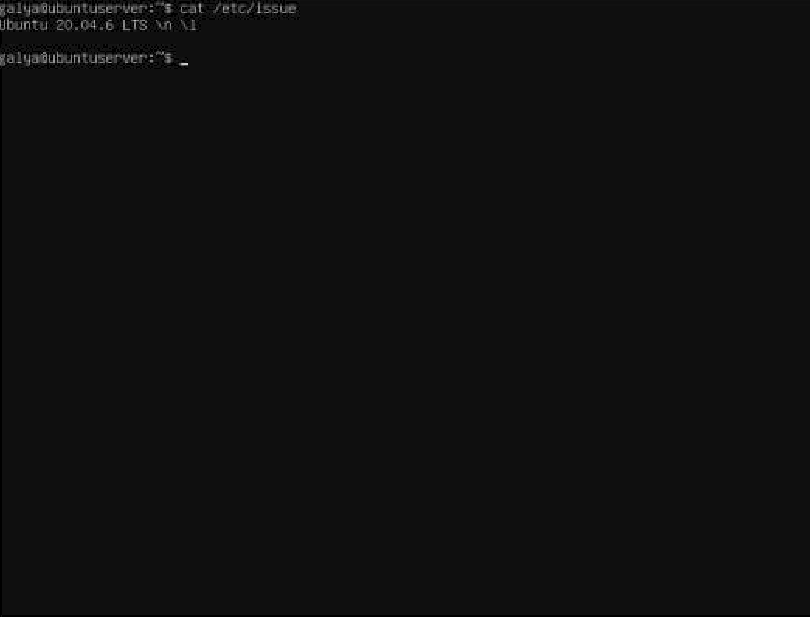

## Part 2. Создание пользователя

- Создан новый пользователь test (отличный от установленного при установке)
- Пользователь добавлен в группу `adm`
- Пользователь виден в выводе `cat /etc/passwd`

**Создание пользователя командой useradd**

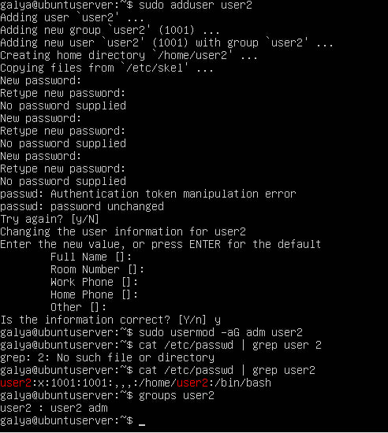

## Part 3. Настройка сети ОС

- Изменила название ВМ на user-1
- Установила временную зону по моему местоположению: sudo timedatectl set-timezone Europe/Moscow
- Вывела названия сетевых интерфейсов с помощью консольной команды ip -br link show. Интерфейс lo (loopback) — это виртуальный интерфейс для внутренней коммуникации системы с самой собой. Он позволяет сетевым приложениям и службам общаться локально без использования физической сети
- Получила ip адрес устройства от DHCP-сервера с помощью команды ip -br addr show. ip адрес: 10.0.2.15. DHCP — протокол автоматической раздачи IP-адресов и сетевых настроек устройствам в сети.
- С помощью команды curl ifconfig.me определила и вывела на экран внешний ip-адрес шлюза (ip). У меня 188.243.231.27. С помощью ip route show default определила и вывела внутренний IP-адрес шлюза. У меня 10.0.2.2. 
-Проверила текущую конфигурацию Netplan с помощью команды ls /etc/netplan/ 
- Настроила статический IP 10.0.2.100/24, шлюз 10.0.2.2 и DNS 8.8.8.8, 1.1.1.1 через редактирование файла /etc/netplan/00-installer-config.yaml и применение командой sudo netplan apply
- Командами ping -c 2 10.0.2.2 и ping -c 2 8.8.8.8 проверила работоспособность сети после настройки статического IP
-  Выполнила финальную проверку доступности интернета командами ping -c 4 1.1.1.1 и ping -c 4 ya.ru. Оба пинга успешны. 

**Скриншот с пингом удаленных хостов 1.1.1.1 и ya.ru**

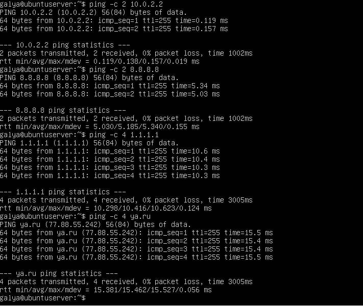

## Part 4. Обновление ОС

**Скриншот с сообщением об отсутствии обновлений**

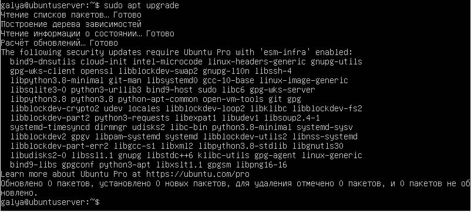

## Part 5. Использование команды sudo

- Sudo позволяет обычным пользователям временно выполнять команды с правами суперпользователя (root).

**Скриншот с изменённым hostname**

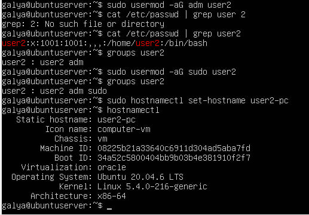

## Part 6. Установка и настройка службы времени

**Скриншот с корректным временем и выводом команды NTPSynchronized=yes:timedatectl show**

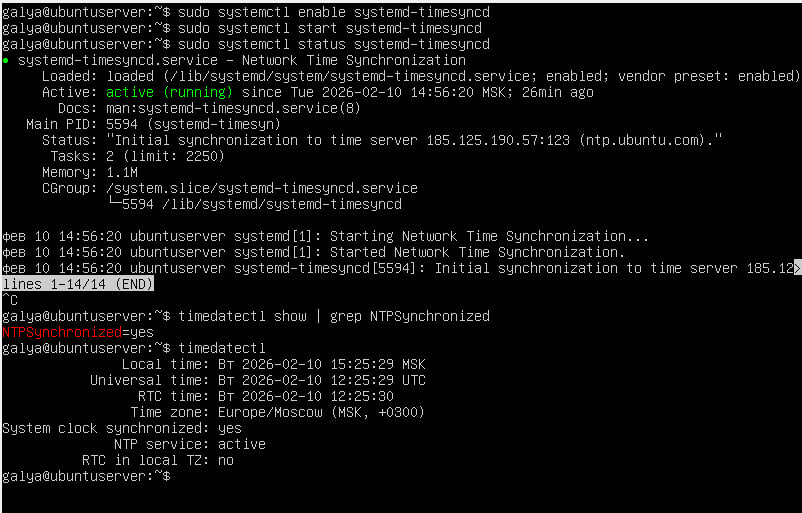

## Part 7. Установка и использование текстовых редакторов

- В nano для выхода с сохранением изменений нажала Ctrl+X → Y → Enter.

**Скриншот редактора Nano с содержимым файла перед закрытием**

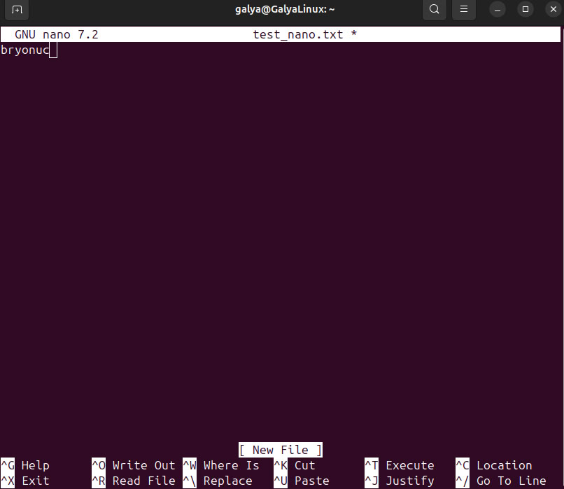

- В Vim нажала Esc → :wq → Enter.

**Скриншот редактора Vim с содержимым файла перед закрытием**

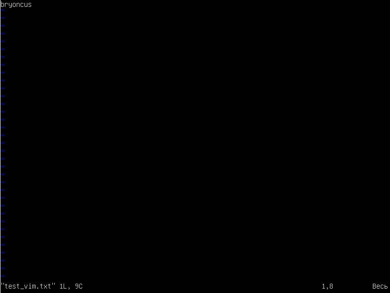

- В mcedit  нажала F2  → Enter → F10.

**Скриншот редактора Mcedit с содержимым файла перед закрытием**

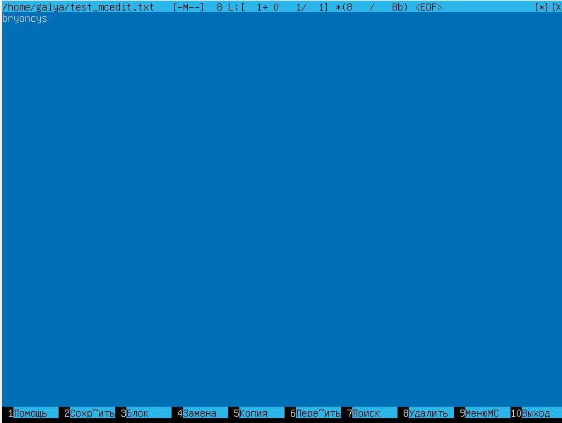

- В nano для выхода без сохранения изменений нажала Ctrl+X → N.

**Скриншот редактора Nano с содержимым файла после редактирования**

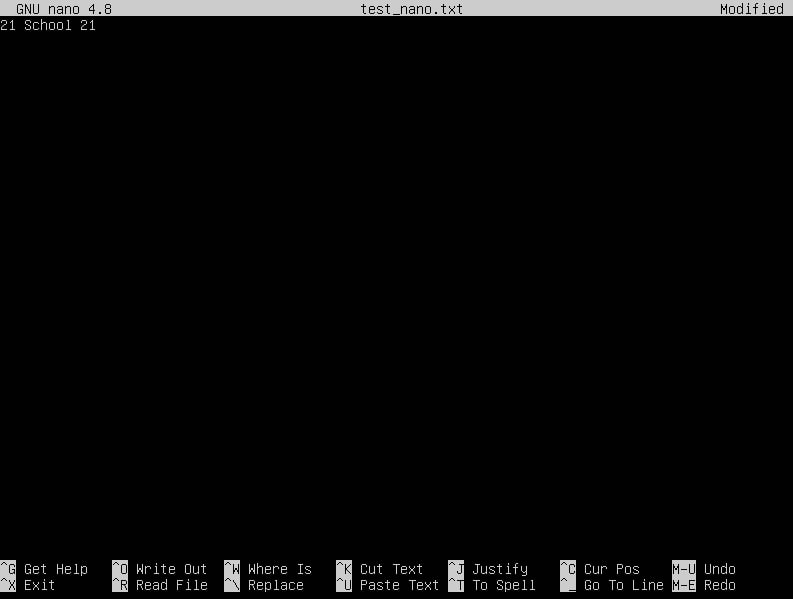

- В Vim нажала Esc → :q! → Enter.

**Скриншот редактора Vim с содержимым файла после редактирования**

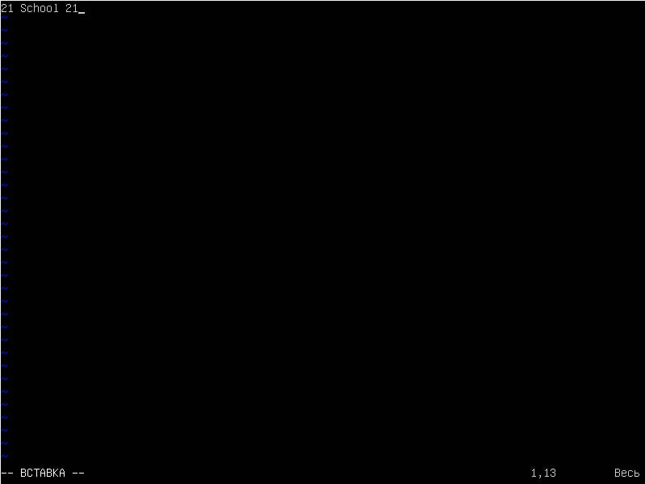

- В mcedit F10 → No

**Скриншот редактора Mcedit с содержимым файла после редактирования**

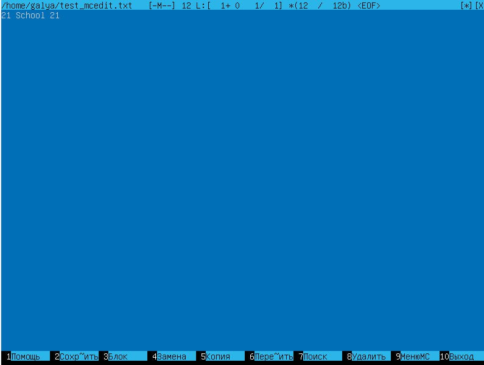

**Скриншот редактора Nano с поиском слов**

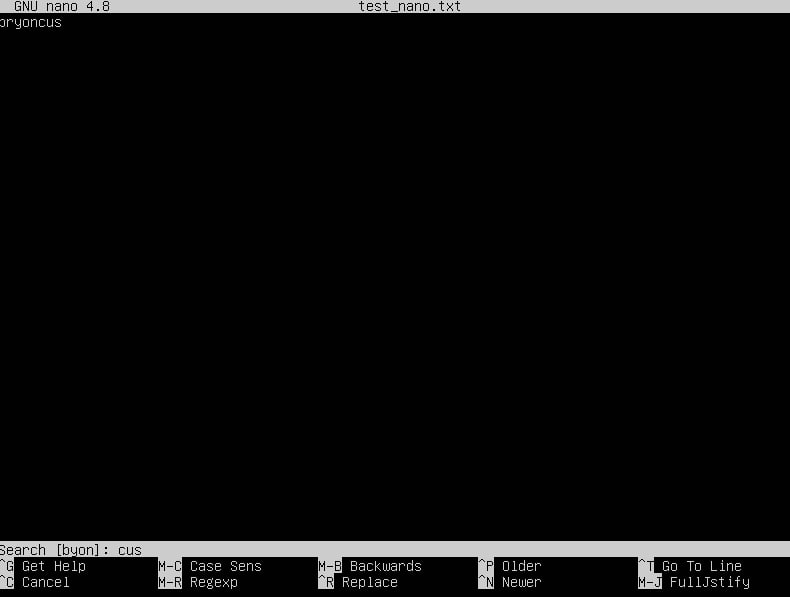

**Скриншот редактора Nano с заменой слов**

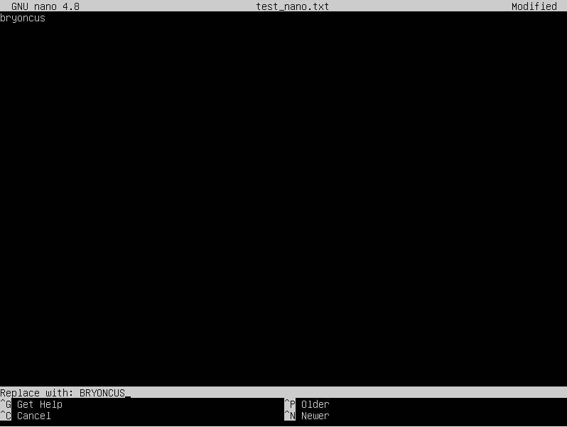

**Скриншот редактора Vim с поиском слов**

**Скриншот редактора Vim с заменой слов**

**Скриншот редактора Mcedit с поиском слов**

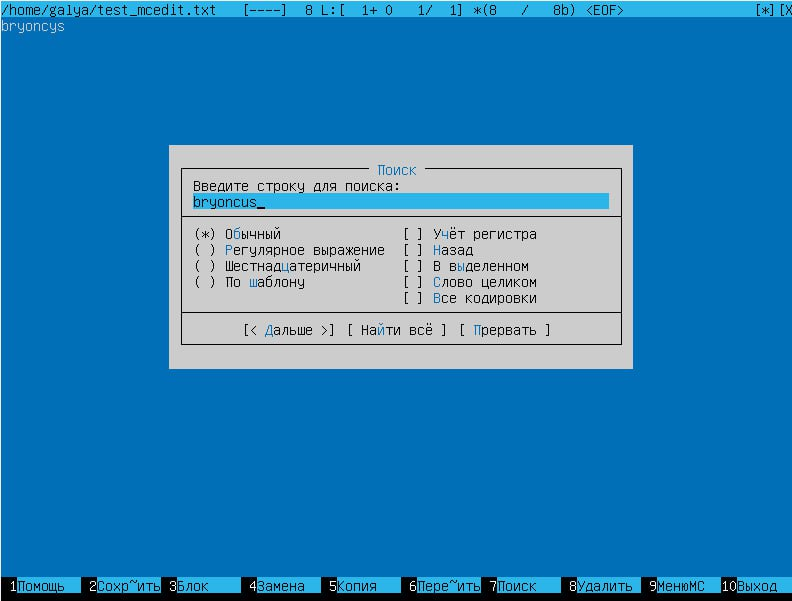

**Скриншот редактора Mcedit с заменой слов**

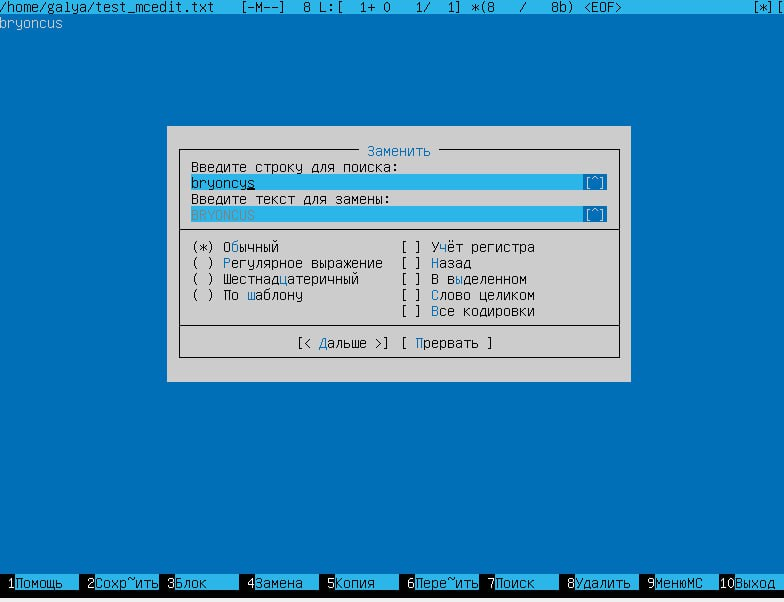

## Part 8. Установка и базовая настройка сервиса SSHD

- Установила SSHd: sudo apt install openssh-server -y
- Добавила автостарт службы при загрузке системы: sudo systemctl enable ssh
- Изменила порт на 2022 в /etc/ssh/sshd_config, убрала значок #
- Проверила процесс: ps -ef | grep sshd
Объяснение ключей: -e все процессы, -f полный формат
- Перезагрузила систему: sudo reboot
- После перезагрузки установила net-tools: sudo apt install net-tools -y
- Проверила порт 2022: sudo netstat -tan. Вывод: tcp 0 0 0.0.0.0:2022 0.0.0.0:* LISTEN

**Скриншот c выводом команды netstat -tan**

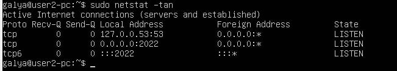

-Объяснение команды netstat -tan:

Ключи:
- -t — отображение TCP-соединений
- -a — отображение всех соединений (включая слушающие порты)
- -n — отображение IP-адресов и портов в числовом формате

Столбцы вывода:
- Proto — протокол (tcp)
- Recv-Q — очередь полученных, но не прочитанных данных
- Send-Q — очередь отправленных, но не подтверждённых данных
- Local Address — локальный IP-адрес и порт
- Foreign Address — удалённый IP-адрес и порт
- State — состояние соединения (LISTEN — прослушивание)

Значение 0.0.0.0:
Означает, что служба SSHd слушает на всех сетевых интерфейсах системы, а не только на localhost (127.0.0.1). Это позволяет подключаться к серверу как с самой машины, так и по сети.

## Part 9. Установка и использование утилит top, htop

Вывод команды top:
- uptime: 10 мин
- количество авторизованных пользователей: 1
- средняя загрузка системы: 0,27, 0,51, 0,48
- общее количество процессов: 347
- загрузка cpu: 2.5% us, 2.5% sy, 0.0% ni, 94.5% id, 0.3% wa, 0.0% hi, 0.2% si, 0.0% st
- загрузку памяти: 15940.5 MiB total, 9238.3 MiB free, 3766.5 MiB used, 2584.1 MiB buff/cache
- pid процесса занимающего больше всего памяти: 4824
- pid процесса, занимающего больше всего процессорного времени: 2907

**Скриншот htop, отсортированный по PID**

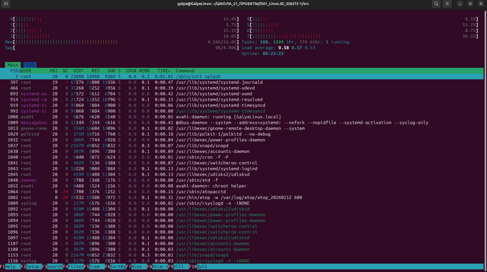

**Скриншот htop, отсортированный по PERCENT_CPU**

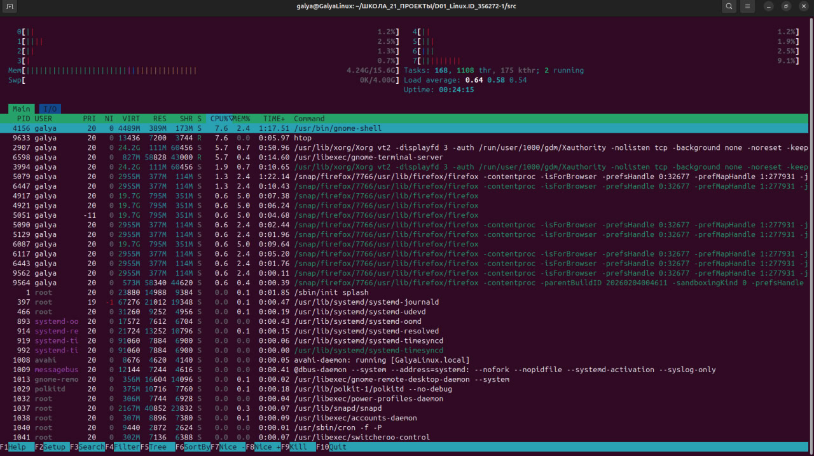

**Скриншот htop, отсортированный по PERCENT_MEM**

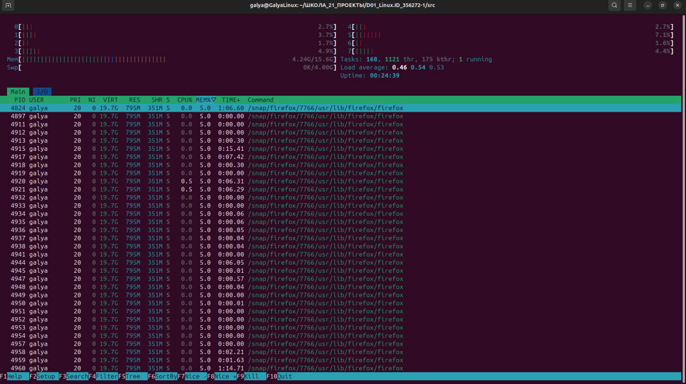

**Скриншот htop, отсортированный по TIME**

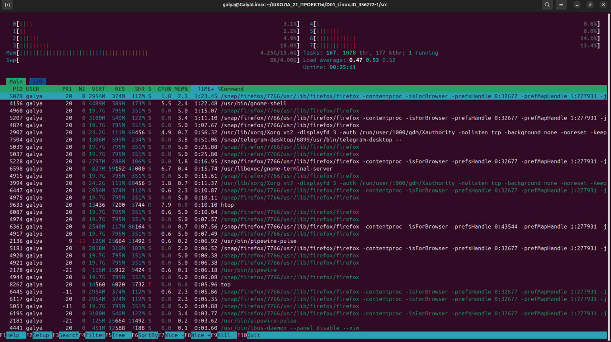

**Скриншот htop, отфильтрованный по процессу sshd**

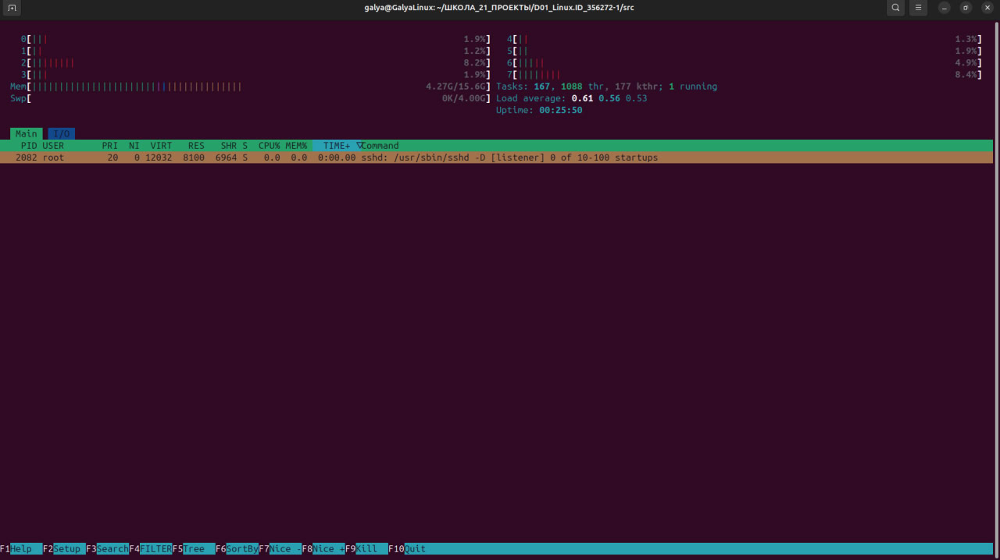

**Скриншот htop с найденным процессом syslog (поиск)**

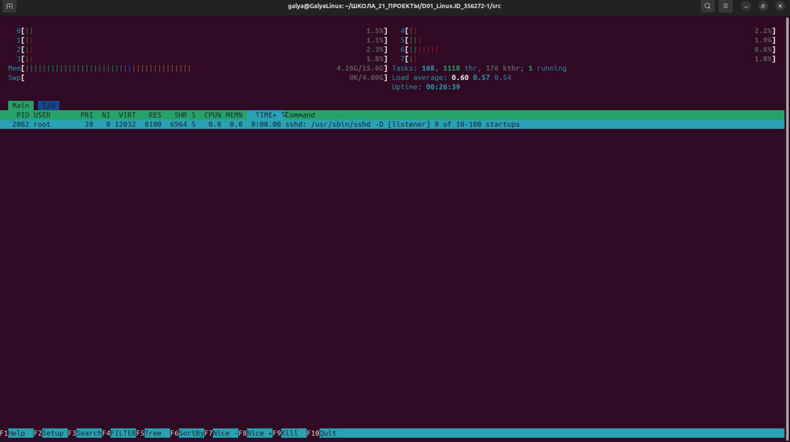

**Скриншот htop с добавленными полями hostname, clock, uptime**

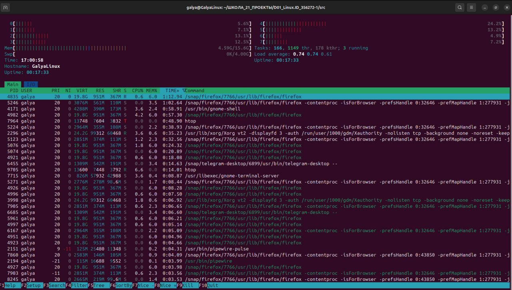

## Part 10. Использование утилиты fdisk

- название жесткого диска: /dev/sdb
- размер: 238.47 GiB
- количество секторов: 500118192
- размер swap: 4.0 GiB

## Part 11. Использование утилиты df

Результат по корневому каталогу (/) после запуска команды df:
- размер раздела: 245023004
- размер занятого пространства: 38009688
- размер свободного пространства: 194494048
- процент использования: 17%
- единица измерения в выводе: 1K-блоки (1 блок = 1024 байта)

 Результаты по корневому каталогу (/): после запуска команды df -Th:
- размер раздела: 234G
- размер занятого пространства: 37G
- размер свободного пространства: 186G
- процент использования: 17%
- тип файловой системы для раздела: ext4

## Part 12. Использование утилиты du

**Запуск команды du**

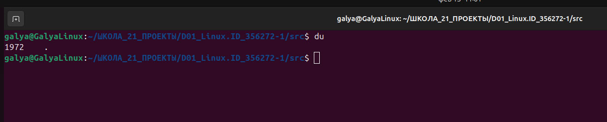

**Вывод размера папок /home, /var, /var/log (в байтах, в человекочитаемом виде**

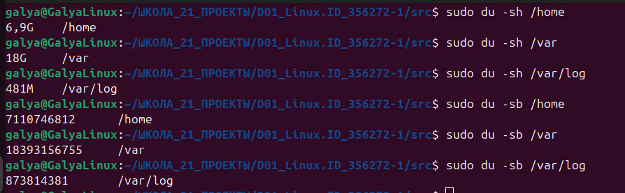

**Размер всего содержимого в /var/log (не общее, а каждого вложенного элемента)**

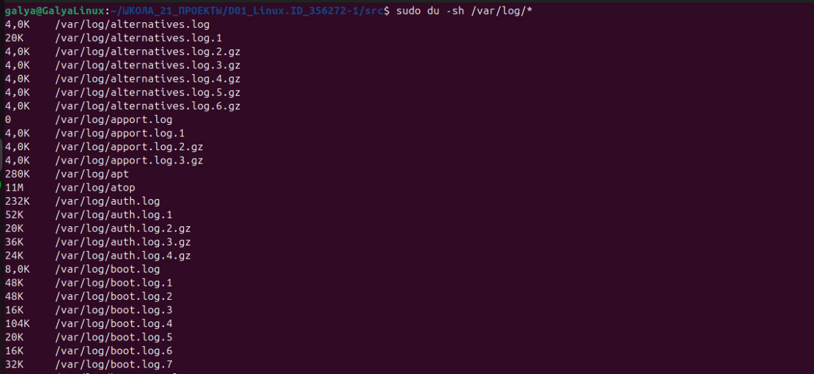

## Part 13. Установка и использование утилиты ncdu

**Просмотр размера папки /home с помощью утилиты ncdu**

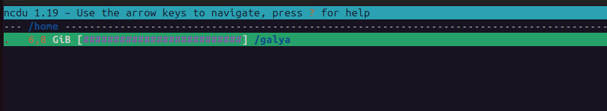

**Просмотр размера папки /var с помощью утилиты ncdu**

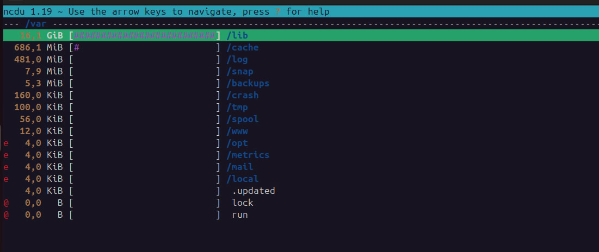

**Просмотр размера папки /var/log с помощью утилиты ncdu**

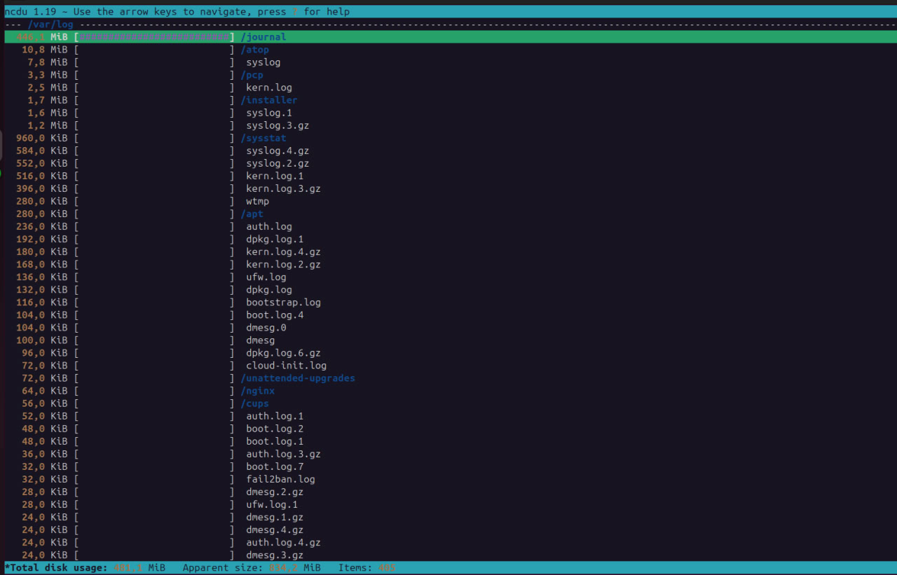

## Part 14. Работа с системными журналами

- Время последней успешной авторизации: 2026-02-14 11:44:49, имя пользователя: galya, метод входа: gdm-autologin (автоматический вход через графический менеджер).

**Скрин с сообщением о рестарте службы**

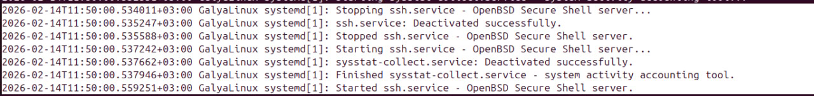

## Part 15. Использование планировщика заданий CRON

**Записи о выполнении uptime в системных журналах**

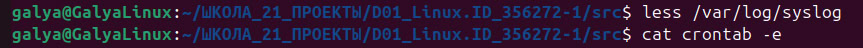

**Список заданий CRON до удаления**

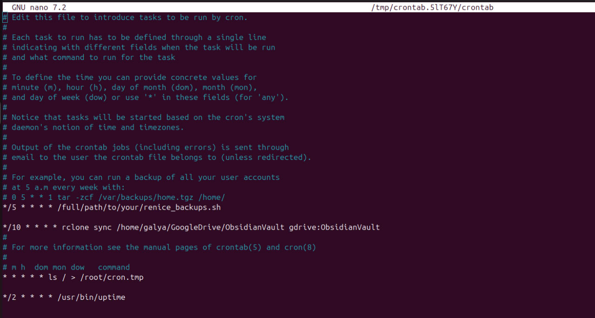

**Список заданий CRON после удаления**

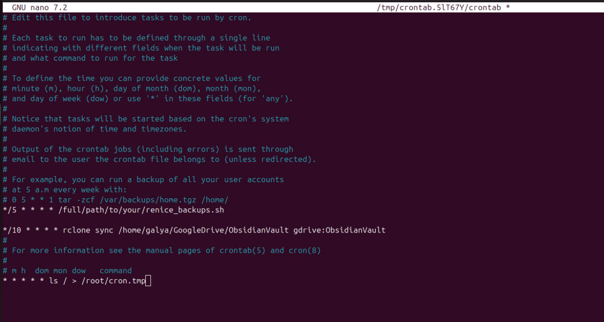
