# Part 1. Инструмент ipcalc

## 1.1. Сети и маски

1. Ответ: 192.160.0.0

2. Ответ:
   - Префикс: /24, двоичная запись: 1111111111.11111111.111111.00000000
   - Обычная: 255.254.0.0, двоичная: 1111111111.11111110.00000000.00000000 
   - Обычная: 255.255.255.240, префиксная: /28 

3. Минимальный и максимальный хост в сети 12.167.38.4 при маске /8:
   - HostMin: 12.0.0.1
   - HostMax: 12.255.255.254  

   При маске 11111111.11111111.00000000.00000000:
   - HostMin: 12.167.0.1  
   - HostMax: 12.167.255.254

   При маске 255.255.254.0:
   - HostMin:   12.167.38.1 
   - HostMax:   12.167.39.254

   При маске /4:
   - HostMin: 0.0.0.1 
   - HostMax: 15.255.255.254

## 1.2. localhost

- 194.34.23.100 — нет
- 127.0.0.2 — да
- 127.1.0.1 — да
- 128.0.0.1 — нет

## 1.3. Диапазоны и сегменты сетей

1) Публичные: 
- 134.43.0.2
- 172.0.2.1
- 192.172.0.1
- 172.68.0.2
- 192.169.168.1

   Частные:
- 10.0.0.45 
- 192.168.4.2
- 172.20.250.4
- 172.16.255.255
- 10.10.10.10

2) У сети 10.10.0.0/18 возможны IP-адресов шлюза:
- 10.10.0.2
- 10.10.10.10
- 10.10.1.255

Невозможны:
- 10.0.0.1
- 10.10.100.1

# Part 2. Статическая маршрутизация между двумя машинами

## Просмотр существующих сетевых интерфейсов с помощью команды `ip a`

**Просмотр сетевых интерфейсов у ws1**

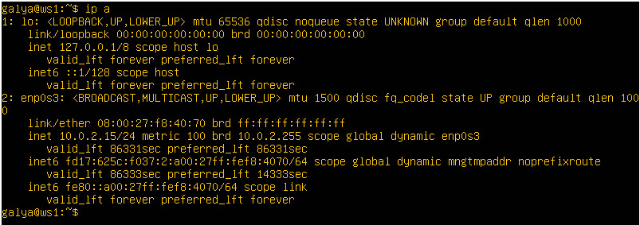

**Просмотр сетевых интерфейсов у ws2**

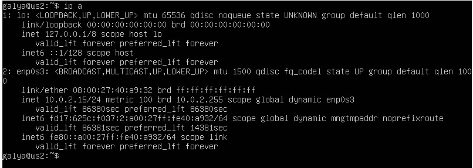

## Создала внутреннюю сеть на обеих машинах и задала следующие адреса и маски: ws1 — 192.168.100.10, маска /16, ws2 — 172.24.116.8, маска /12

**Содержание файла `/etc/netplan/00-installer-config.yaml` на ws1 после изменений**

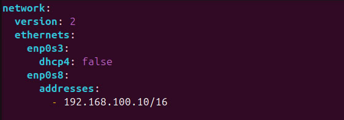

**Содержание файла `/etc/netplan/00-installer-config.yaml` на ws2 после изменений**

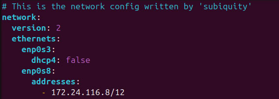

## Выполнила команду `netplan apply` для перезапуска сервиса сети

**Выполнение команды `netplan apply` на ws1**

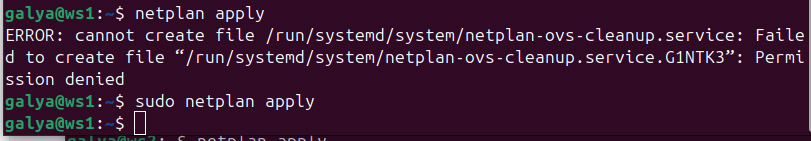

**Выполнение команды `netplan apply` на ws2**

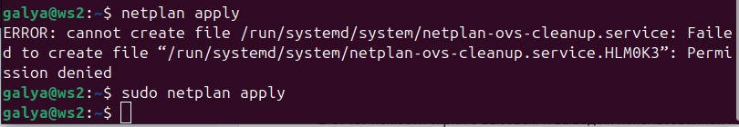

## 2.1. Добавление статического маршрута вручную и пинг от одной машины до другой и обратно

**Добавление маршрута и результат пинга с ws1 до ws2**

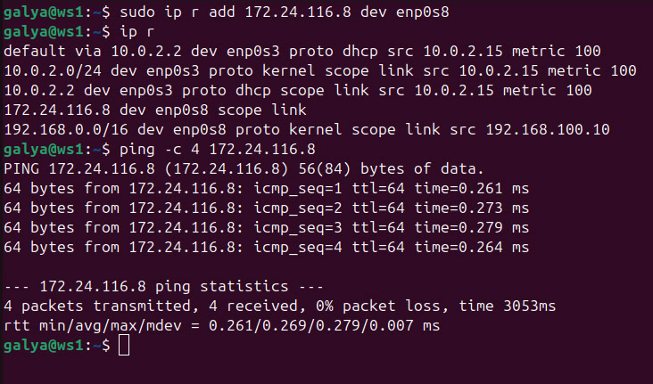

**Добавление маршрута и результат пинга с ws2 до ws1**

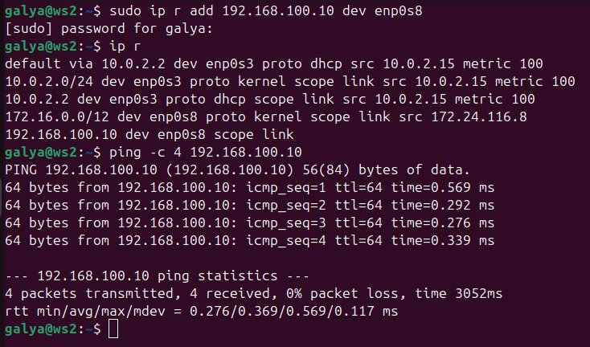

## 2.2. Добавление статического маршрута с сохранением

**Содержание файла `/etc/netplan/00-installer-config.yaml` на ws1 после добавления маршрута**

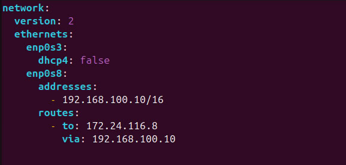

**Содержание файла `/etc/netplan/00-installer-config.yaml` на ws2 после добавления маршрута**

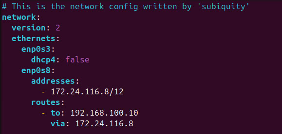

**Проверка соединения: пинг с ws1 до ws2 (172.24.116.8)**

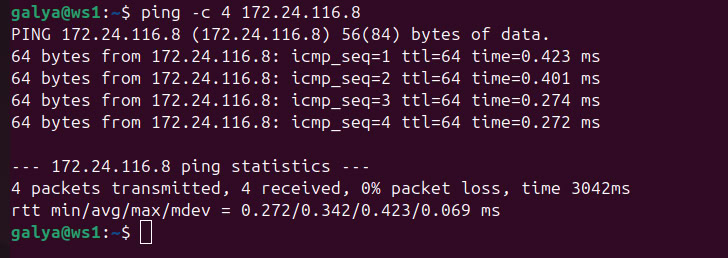

**Проверка соединения: пинг с ws2 до ws1 (192.168.100.10)**

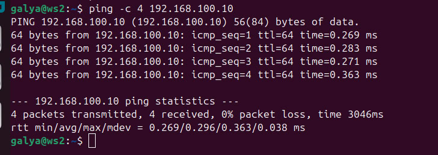

# Part 3. Утилита iperf3

## 3.1. Скорость соединения

- 8 Mbps = 1 MB/s
- 100 MB/s = 800 000 Kbps
- 1 Gbps = 1000 Mbps

## Измерила скорость соединения между ws1 и ws2 с помощью `iperf3`

## 3.2. Утилита iperf3

**Запуск сервера iperf3 на ws1**

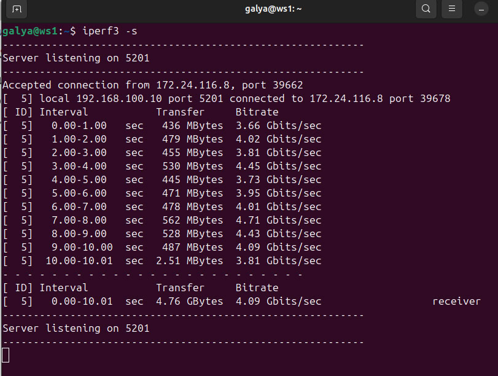

**Запуск клиента на ws2 и измерение скорости до ws1 (192.168.100.10)**

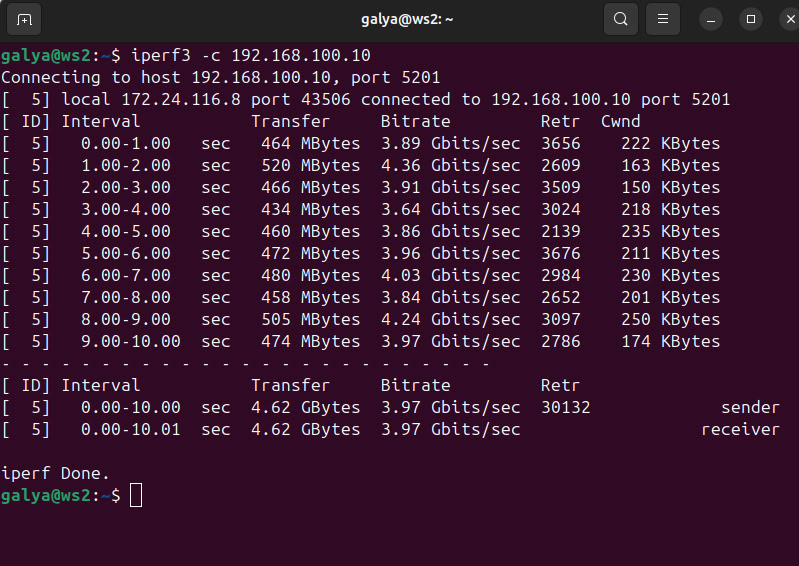

**Запуск сервера iperf3 на ws2**

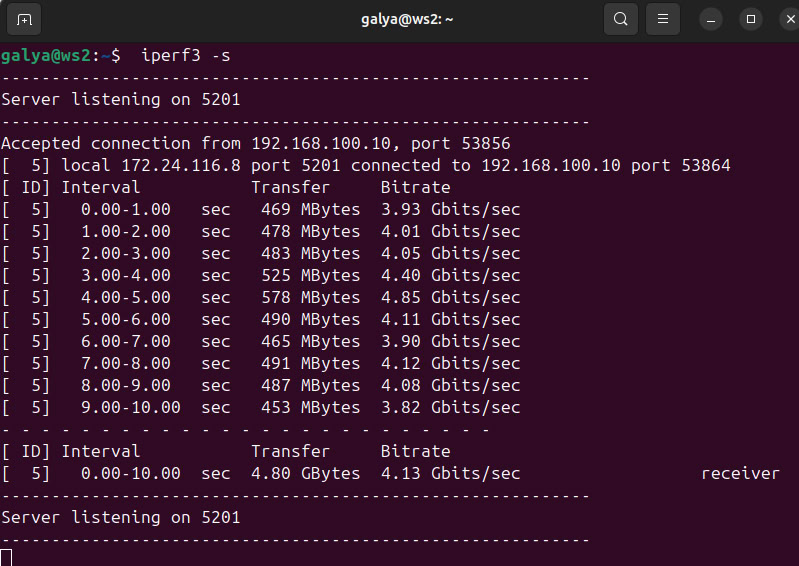

**Запуск клиента на ws1 и измерение скорости до ws2 (172.24.116.8)**

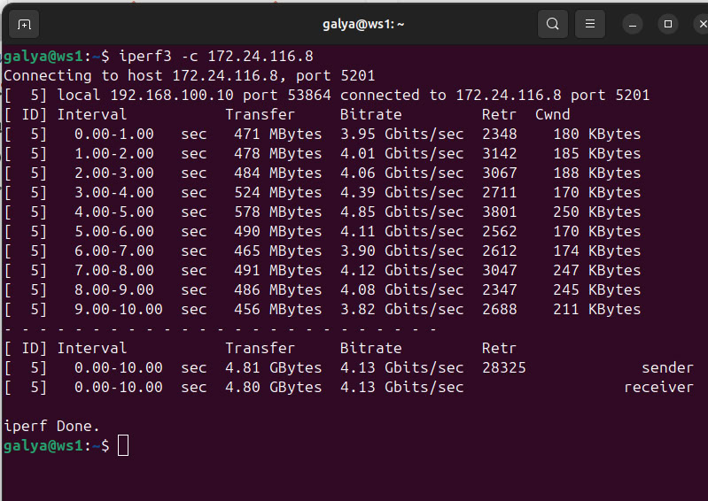

# Part 4. Сетевой экран

## 4.1. Утилита iptables

**Содержимое файла `/etc/firewall.sh` на ws1**

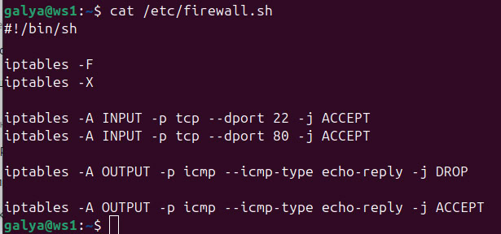

**Содержимое файла `/etc/firewall.sh` на ws2**

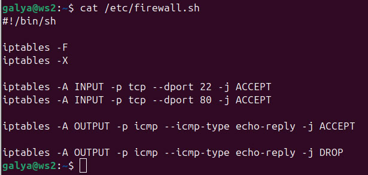

**Запуск скрипта на ws1**

**Запуск скрипта на ws2**

## Описание разницы между стратегиями

На `ws1` применена стратегия «сначала запрет, потом разрешение» для `echo reply`: первое правило в OUTPUT запрещает ответ на ping, поэтому машина не пингуется.  
На `ws2` стратегия обратная — «сначала разрешение, потом запрет»: разрешающее правило срабатывает первым, поэтому ping проходит, а запрет игнорируется.

Порядок правил в `iptables` определяет результат: приоритет имеет первое подходящее правило.

## 4.2. Утилита nmap

**Пинг с ws2 до ws1 — машина не отвечает (блокировка echo-reply на ws1)**

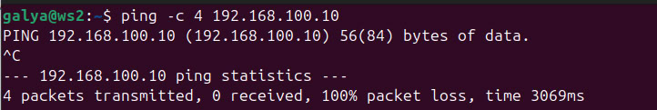

**Проверка nmap: хост ws1 запущен, несмотря на блокировку ping**

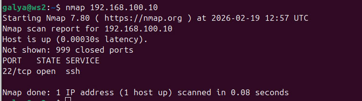

# Part 5. Статическая маршрутизация сети

## 5.1. Настройка адресов машин

## Настройка конфигурации машин в `/etc/netplan/00-installer-config.yaml`

**Рабочая станция ws11**

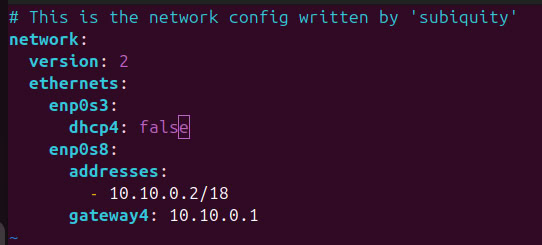

**Рабочая станция ws21**

**Рабочая станция ws22**

**Роутер r1**

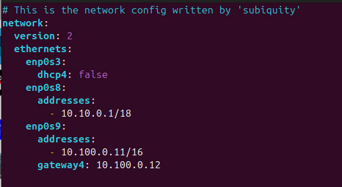

**Роутер r2**

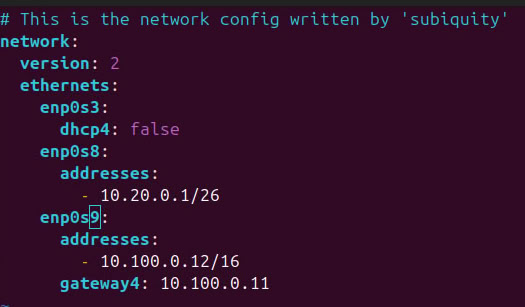

## Перезапуск сети с помощью `sudo netplan apply` и  проверка назначенных IP-адресов `ip -4 a`

**Рабочая станция ws11**

**Рабочая станция ws21**

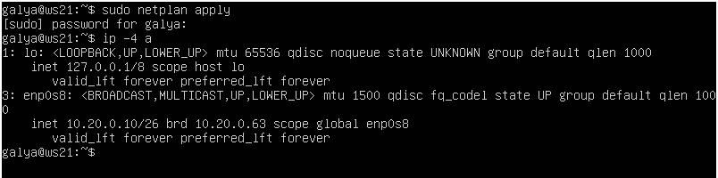

**Рабочая станция ws22**

**Роутер r1**

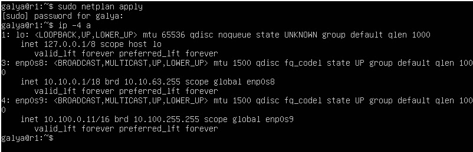

**Роутер r2**

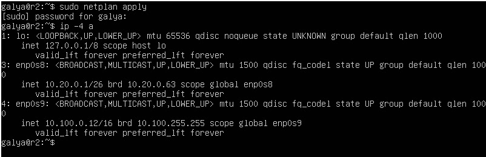

## Проверка доступности (ping)

**Пинг с ws21 до ws22**

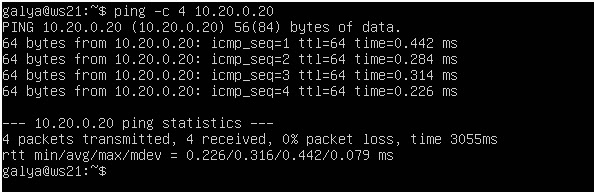

**Пинг с ws11 до роутера r1**

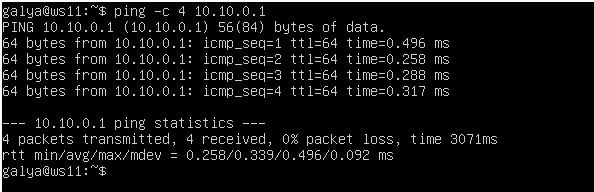

## 5.2 Включение переадресации IP-адресов

**Вызов и вывод команды `sysctl -w net.ipv4.ip_forward=1` на r1**

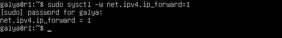

**Вызов и вывод команды `sysctl -w net.ipv4.ip_forward=1` на r2**

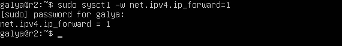

**Изменённый файл `/etc/sysctl.conf` на r1**

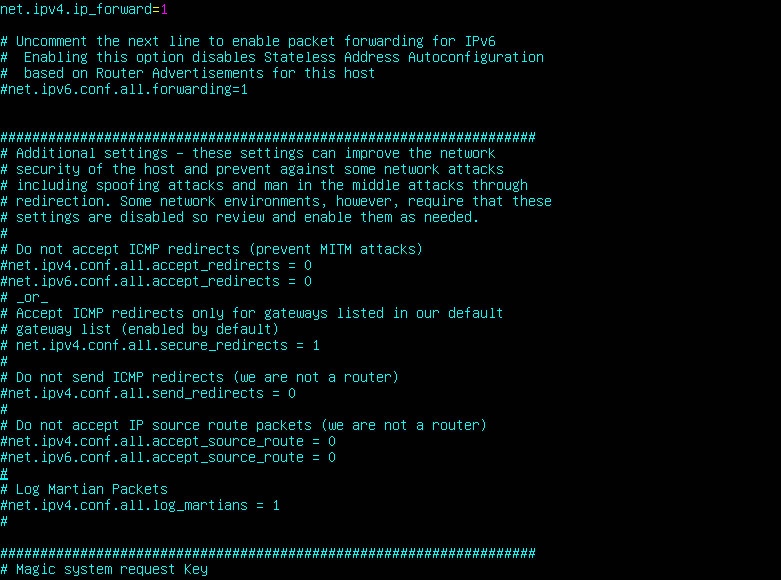

**Изменённый файл `/etc/sysctl.conf` на r2**

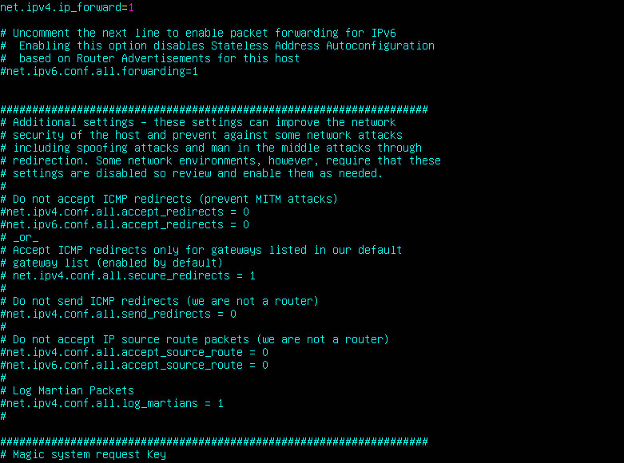

## 5.3 Установка маршрута по умолчанию

**Содержание `/etc/netplan/00-installer-config.yaml` на ws11:**

**Содержание `/etc/netplan/00-installer-config.yaml` на ws21:**

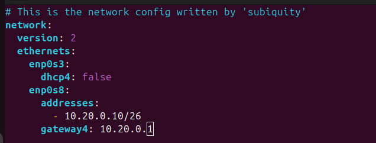

**Содержание `/etc/netplan/00-installer-config.yaml` на ws22:**

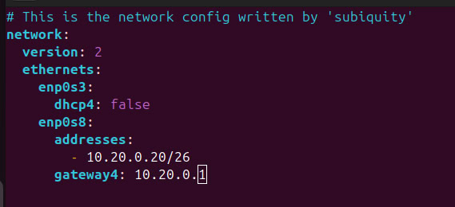

**Вывод `ip r` на ws11:**

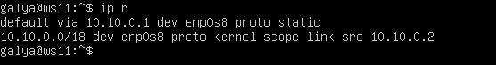

**Вывод `ip r` на ws21:**

**Вывод `ip r` на ws22:**

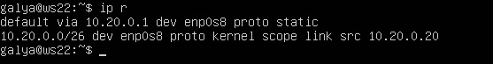

**Пинг с ws11 до r2:**

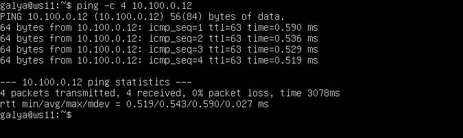

**Захват пакетов на r2 с помощью команды `tcpdump -tn -i enp0s9`**

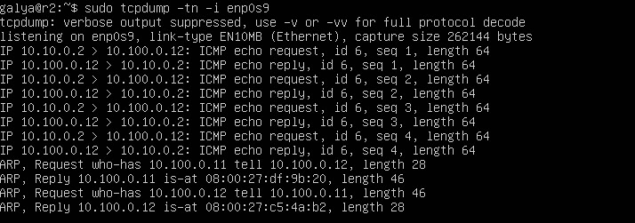

## 5.4 Добавление статических маршрутов

**Содержание `/etc/netplan/00-installer-config.yaml` на r1:**

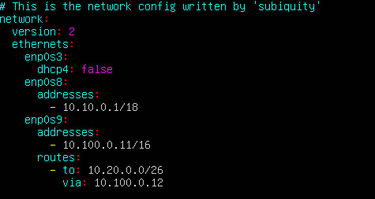

**Содержание `/etc/netplan/00-installer-config.yaml` на r2:** 

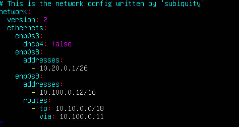

**Вывод `ip r` на r1:**

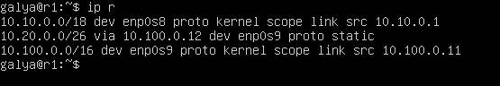

**Вывод `ip r` на r2:**

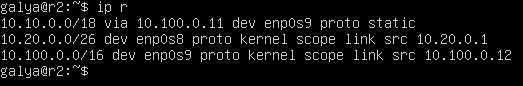

**Запросы маршрутов к сети 10.10.0.0/18 и к 0.0.0.0/0 на ws11:**

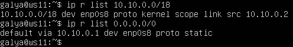

### Объяснение выбора маршрута

При наличии нескольких маршрутов, покрывающих один и тот же адрес, предпочтение отдаётся маршруту с наиболее длинной маской — он точнее. Маршрут к сети 10.10.0.0/18 имеет маску 18, что длиннее, чем маска 0 у маршрута по умолчанию, поэтому используется именно он.

## 5.5. Построение списка маршрутизаторов

**Tcpdump -tnv -i enp0s8 на r1:**

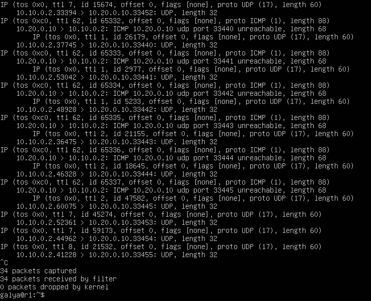

**Traceroute с ws11 до ws21:**

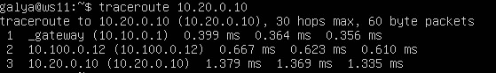

### Объяснение принципа работы построения пути при помощи traceroute

Утилита `traceroute` отправляет последовательность UDP-пакетов с увеличивающимися значениями TTL, начиная с 1. Каждый маршрутизатор на пути уменьшает TTL на 1, и при обнулении отправляет обратно ICMP-сообщение `Time Exceeded`.

Когда пакет достигает целевого хоста, последний отвечает ICMP-сообщением `Destination Port Unreachable` (так как используется редко занимаемый порт), что сигнализирует о завершении трассировки.

В полученном выводе `tcpdump` на r1 это подтверждается наличием UDP-пакетов от ws11 10.10.0.2 с TTL=1 и финальных ICMP-ответов от ws21 10.20.0.10 о недоступности порта, что доказывает корректную работу сети и маршрутизации.

## 5.6. Использование протокола ICMP при маршрутизации

**Запуск tcpdump на r1 и его вывод:**

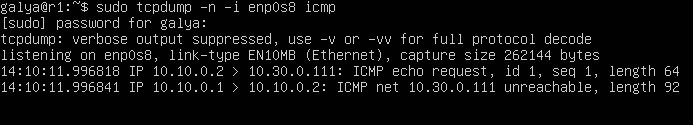

**Выполнение ping с ws11 на 10.30.0.111:**

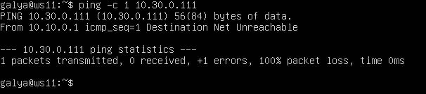

# Part 6. Динамическая настройка IP с помощью DHCP

## Настройка DHCP-сервера на r2

**Содержание `/etc/dhcp/dhcpd.conf` на r2:**

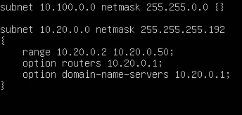

**Содержание `/etc/resolv.conf` на r2:**

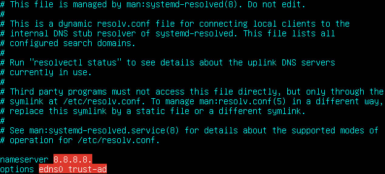

**Перезапуск DHCP-сервера на r2:**

**Перезагрузка ws21:**

**Вывод `ip a` на ws21:**

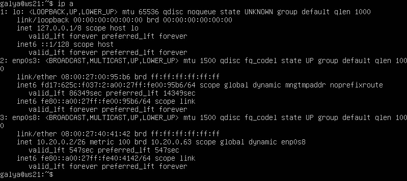

**Пинг с ws21 до ws22:**

## Настройка DHCP-сервера на r1

**Содержание `/etc/netplan/00-installer-config.yaml` на ws11:**

**Содержание `/etc/dhcp/dhcpd.conf` на r1:**

**Перезапуск DHCP-сервера на r1:**

**Вывод `ip a` на ws11:**

## Пример обновления IP-адреса на ws21

**Вывод `ip a` на ws21 до обновления:**

**Запрос нового IP-адреса на ws21:**

**Вывод `ip a` на ws21 после обновления:**

Для обновления IP-адреса на ws21 использовались команды dhclient -r и dhclient. В конфигурации DHCP-сервера для выдачи параметров сети применялись опции option routers (шлюз) и option domain-name-servers (DNS).

# Part 7. NAT

## Настройка веб-сервера Apache

**Содержание `/etc/apache2/ports.conf` на r1:**

**Содержание `/etc/apache2/ports.conf` на ws22:**

**Запуск Apache на r1:**

**Запуск Apache на ws22:**

## Настройка фаервола на r2

**Содержание скрипта фаервола с правилами:**

**Выдача прав и запуск фаервола на r2:**

**Пинг с ws22 до r1 (не должен проходить):**

## Добавление разрешения ICMP

**Содержание скрипта фаервола с добавленным правилом ICMP:**

**Пинг с ws22 до r1 (успешный):**

## Добавление SNAT и DNAT

**Содержание скрипта фаервола с SNAT и DNAT:**

**Проверка SNAT:**

**Проверка DNAT:**

# Part 8. Дополнительно. Знакомство с SSH Tunnels

**Изменение конфигурации Apache на ws22 `Listen localhost:80`:**

**Перезапуск Apache на ws22:**

**Local TCP forwarding с ws21 до ws22:**

**Проверка подключения с помощью команды `telnet 127.0.0.1` на ws21):**

**Remote TCP forwarding с ws11 до ws22:**

**Проверка подключения с помощью команды `telnet 127.0.0.1` на ws11):**

