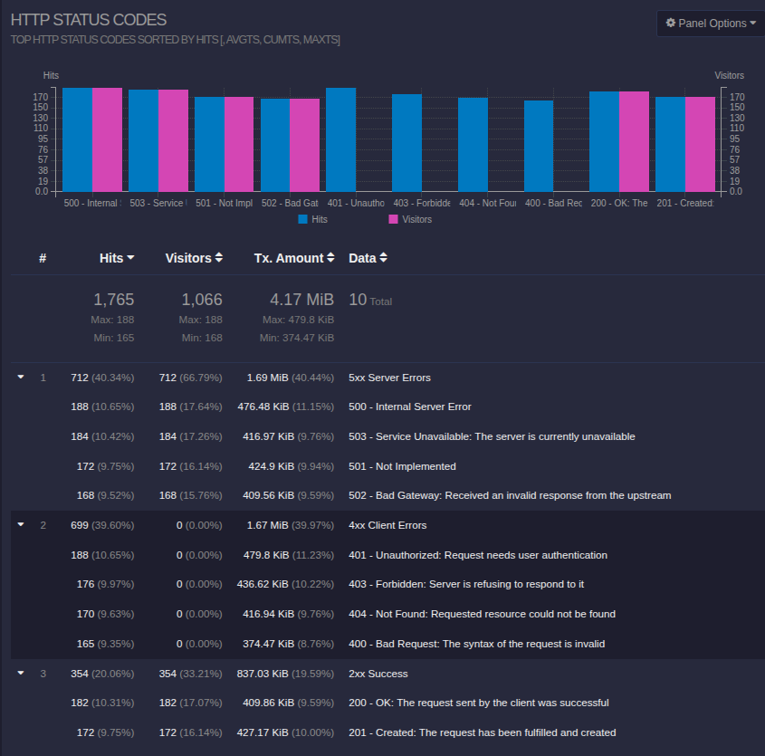
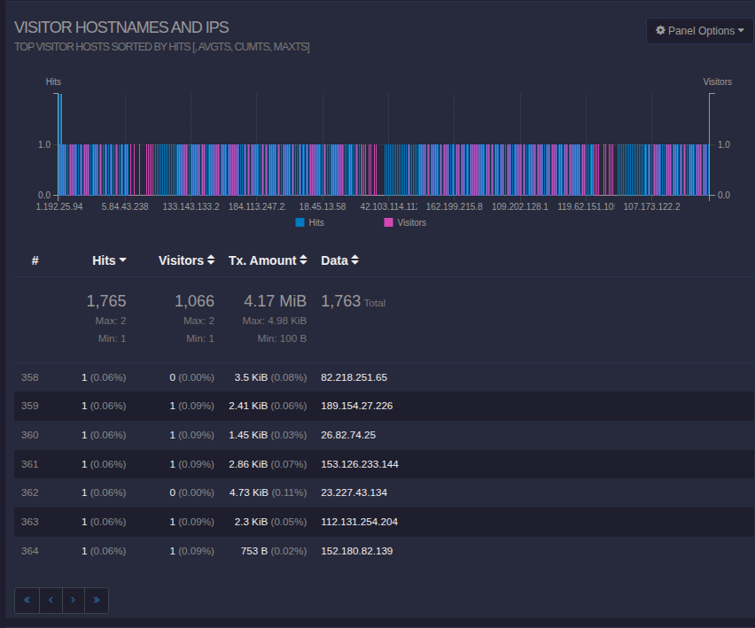
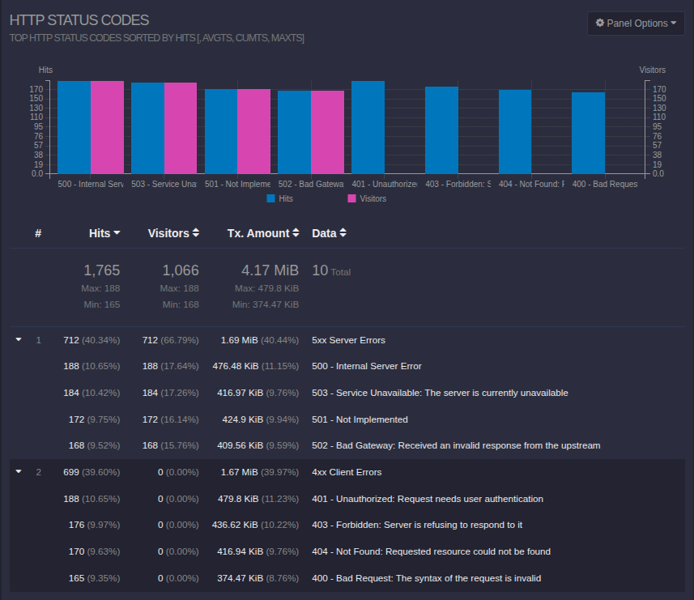
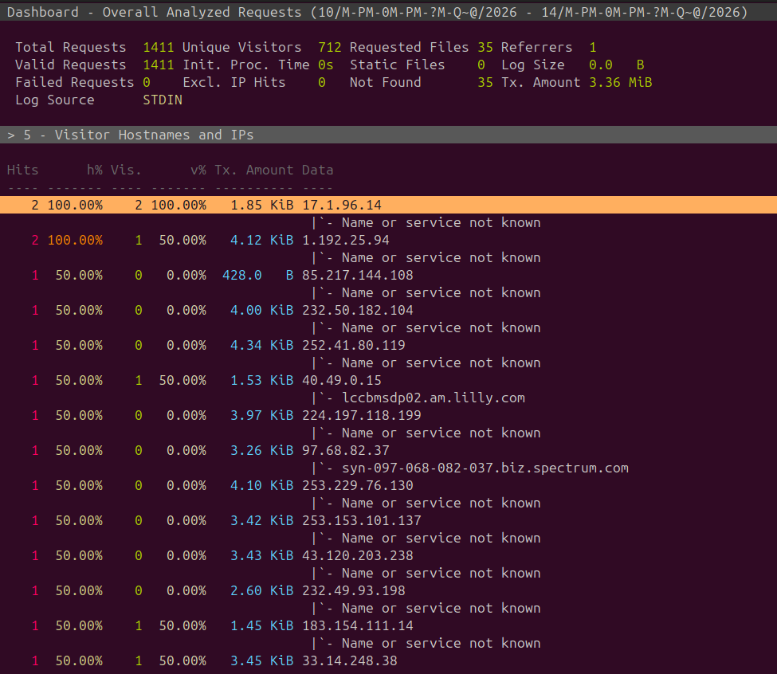

**Сортировка по коду ответа**

**Уникальные IP**

**Запросы с ошибками**

**Уникальные IP среди ошибочных запросов**

**Использовала команды:**

`goaccess ../04/nginx_log_*.log -o report.html --log-format=COMBINED`

`xdg-open report.html`

`awk '$9 ~ /^[45][0-9]{2}$/' ../04/nginx_log_*.log | goaccess --log-format=COMBINED -`
