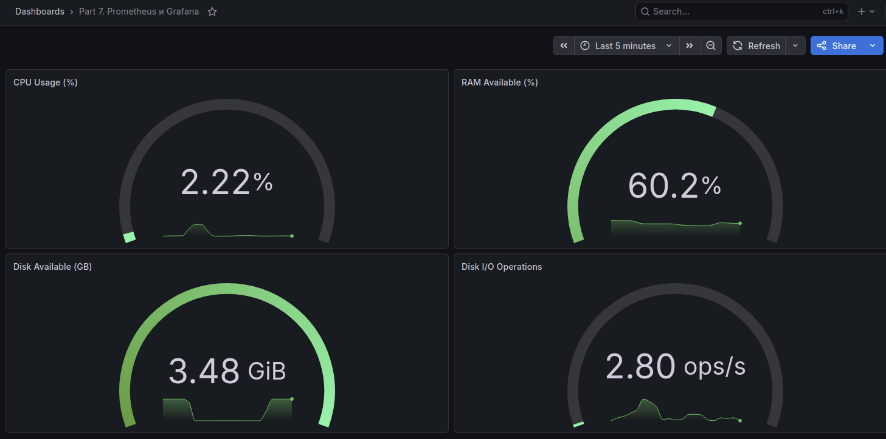
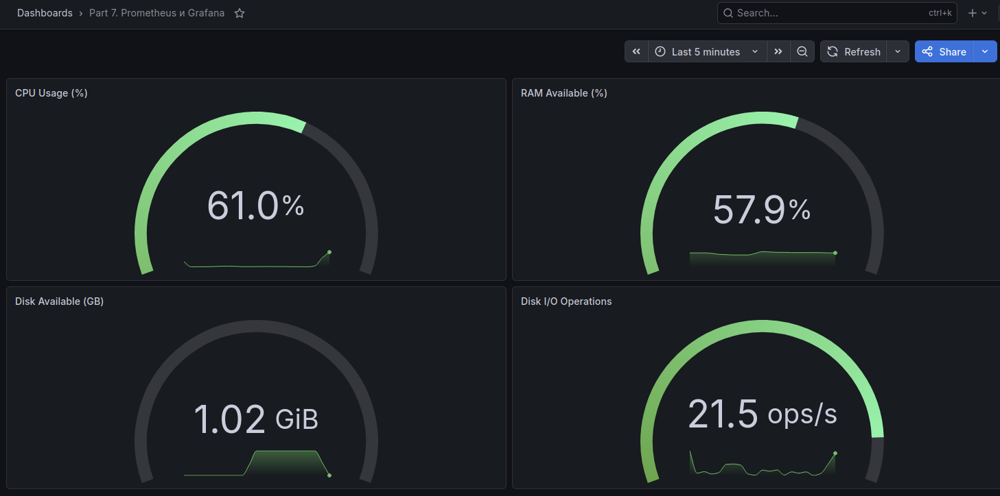
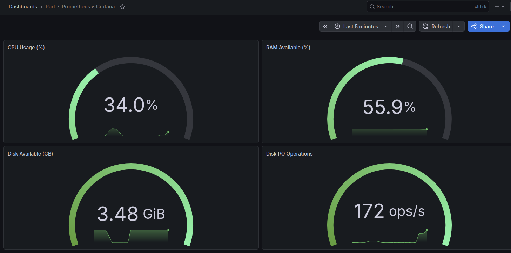

# Part 7. Prometheus и Grafana

## Дашборд Grafana

| **Метрика** | **PromQL-запрос** |
|---------|----------------|
| **CPU Usage (%)** | `100 - (avg by(instance) (rate(node_cpu_seconds_total{mode="idle"}[1m])) * 100)` |
| **RAM Available (%)** | `node_memory_MemAvailable_bytes / node_memory_MemTotal_bytes * 100` |
| **Disk Available (GB)** | `node_filesystem_avail_bytes{mountpoint="/", fstype!="rootfs"} / 1024 / 1024 / 1024` |
| **Disk I/O Operations** | `sum by (instance) (rate(node_disk_reads_completed_total[1m]) + rate(node_disk_writes_completed_total[1m]))` |

## Мониторинг системы при различных нагрузках

**Система в состоянии покоя без дополнительной нагрузки**



**Запущен bash-скрипт из Part 2 для генерации нагрузки**



**Запуск утилиты stress для создания нагрузки**



## Действия для Part 7

**Подключение к виртуальной машине:** 

`ssh -p 2222 galya@127.0.0.1`

**Установила и распаковала Prometheus:** 

`wget https://github.com/prometheus/prometheus/releases/download/v3.11.2/prometheus-3.11.2.linux-amd64.tar.gz` 

`tar xvf prometheus-3.11.2.linux-amd64.tar.gz`

**Установила и распаковала Node Exporter:**

`wget https://github.com/prometheus/node_exporter/releases/latest/download/node_exporter-*.linux-amd64.tar.gz`

`tar xvf node_exporter-*.linux-amd64.tar.gz`

**Настроила конфигурацию Prometheus:**

`nano ~/prometheus-3.11.2.linux-amd64/prometheus.yml`

```yaml
scrape_configs:
  - job_name: "prometheus"
    static_configs:
      - targets: ["localhost:9090"]
        labels:
          app: "prometheus"

  - job_name: "node"
    static_configs:
      - targets: ["localhost:9100"]
```

**Запустила Node Exporter:**

`cd ~/node_exporter-1.8.1.linux-amd64`
` ./node_exporter`

**Запустила Prometheus:**

`cd prometheus-3.11.2.linux-amd64`
`./prometheus --config.file=prometheus.yml --web.listen-address=0.0.0.0:9090`

**Установила Grafana и запустила в контейнере:**

`sudo apt install -y grafana`

`sudo docker run -d -p 3000:3000 --name grafana grafana/grafana`

**Установка утилиты stress и запуск команды для создания нагрузки**

`sudo apt install stress -y`

`stress -c 2 -i 1 -m 1 --vm-bytes 32M -t 10s`


