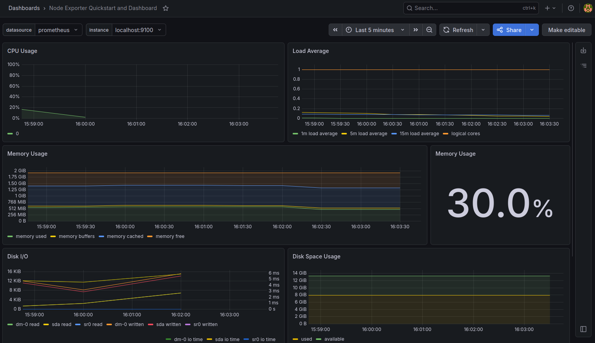
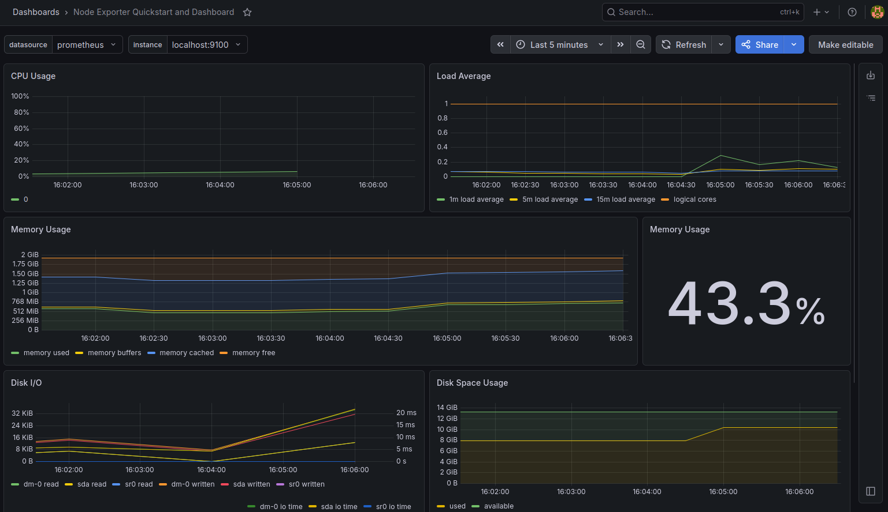
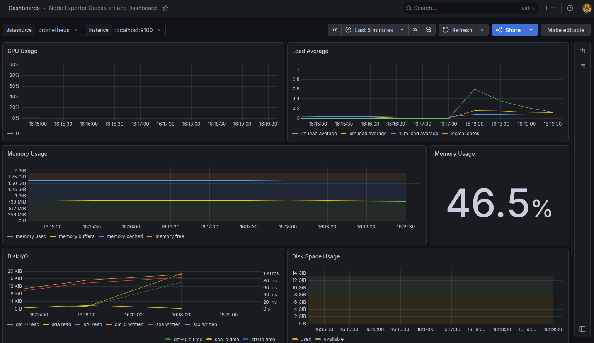
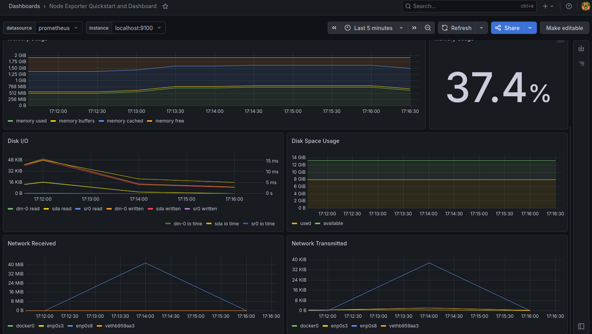
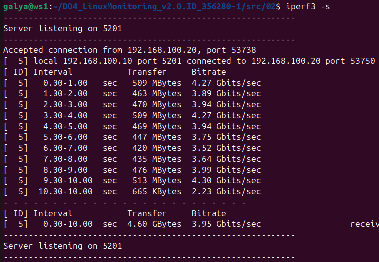
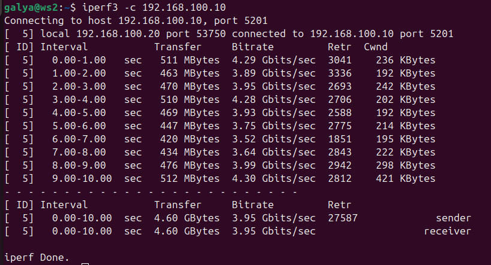

# Part 8. Готовый дашборд Node Exporter Quickstart and Dashboard

**Система в состоянии покоя без дополнительной нагрузки**

**Запущен bash-скрипт из Part 2 для генерации нагрузки**

**Запуск утилиты stress для создания нагрузки**

**Тест нагрузки сети с помощью утилиты iperf3**

**Запуск iperf3 на ws1 (сервер)**

**Запуск iperf3 на ws2 (клиент)**

