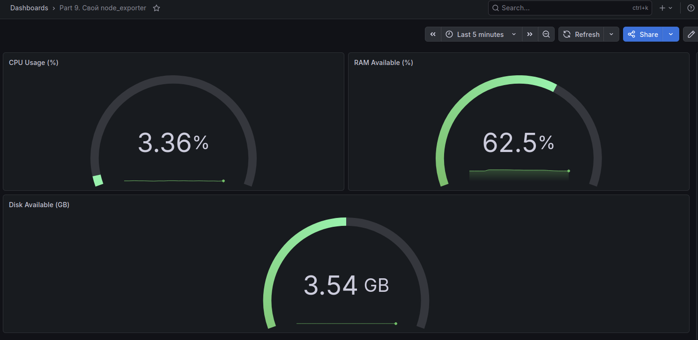
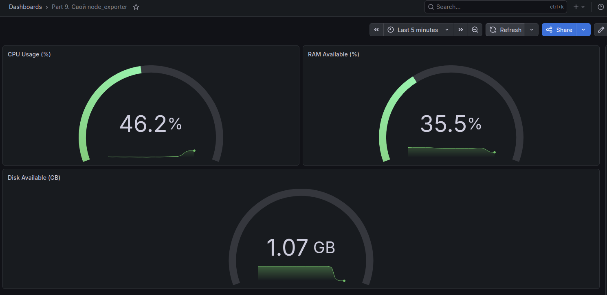
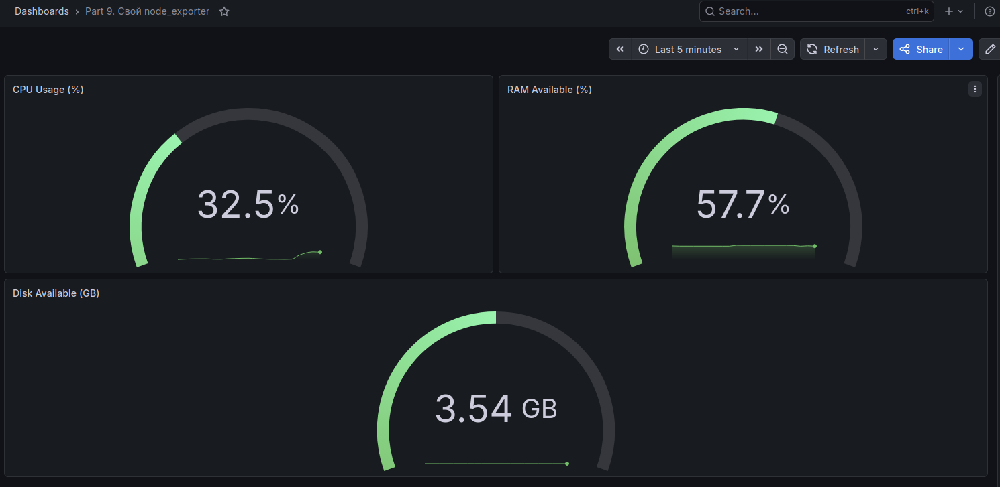
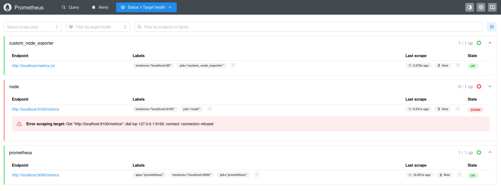

# Part 9. Дополнительно. Свой node_exporter

**Сам bash-скрипт находится в директории 09. Он собирает информацию по базовым метрикам системы (ЦПУ, оперативная память, объем жесткого диска). После этого формирует страничку по формату Prometheus, которую отдаёт nginx.**

**Prometheus, Grafana и custom_node_exporter запущены.**
 
## Мониторинг системы при разных нагрузках

**Система в покое без дополнительной нагрузки**



**Запуск bash-скрипта из Part 2 для генерации нагрузки**



**Запуск утилиты stress для создания нагрузки**



**Успешное подключение к custom_node_exporter на странице Targets в Prometheus**



**Поменяла конфигурационный файл Prometheus, чтобы он собирал новую информацию:**

`nano ~/prometheus-3.11.2.linux-amd64/prometheus.yml`


```yaml
  - job_name: "custom_node_exporter"
    scrape_interval: 3s
    static_configs:
      - targets: ["localhost:80"]
    metrics_path: /metrics.txt
```

## Дашборд Grafana

| **Метрика** | **PromQL-запрос** |
|---------|----------------|
| **CPU Usage (%)** | `avg_over_time(cpu_usage[1m])` |
| **RAM Available (%)** | `(ram_available / ram_total) * 100` |
| **Disk Available (GB)** | `disk_free` |

