## Part 1. Готовый докер

- Скачала официальный докер-образ nginx с помощью `docker pull`
- Проверила наличие докер-образа через `docker images`
- Создала и запустила контейнер на основе образа через `docker run -d [image_id]`
- Проверила запуск контейнера через `docker ps`
- Посмотрела информацию о контейнере через `docker inspect [container_id]`

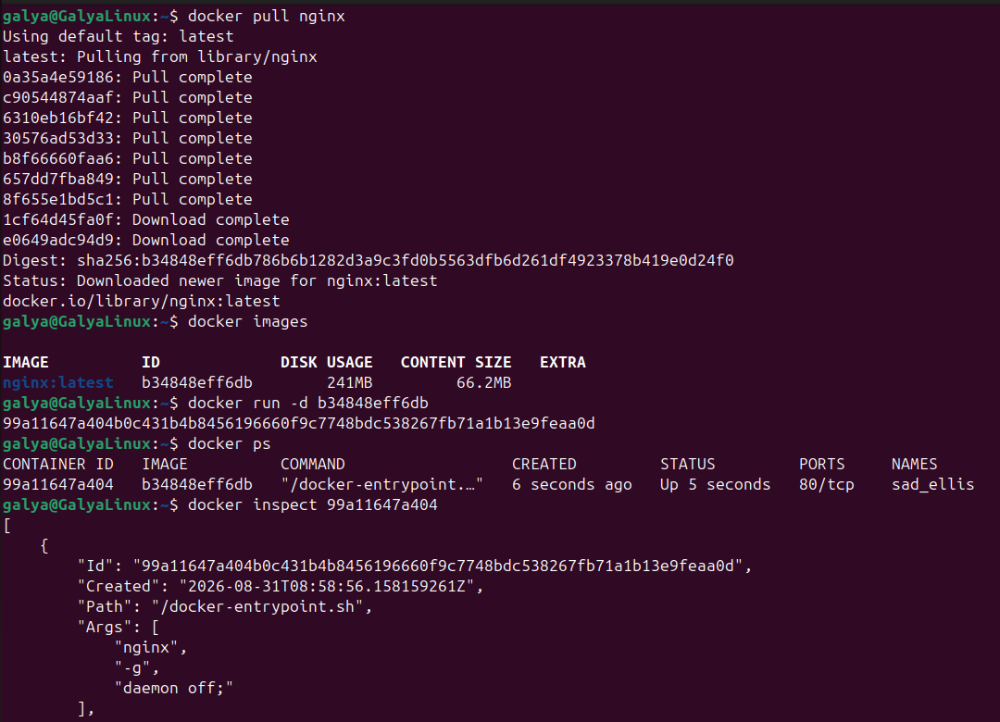 

- По выводу `docker inspect` определила:
1. Размер контейнера

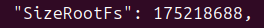

2. Список замапленных портов

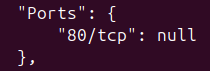

3. Ip контейнера

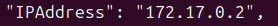

- Остановила докер контейнер через docker `stop [container_id]`
- Проверила остановку контейнера через `docker ps`

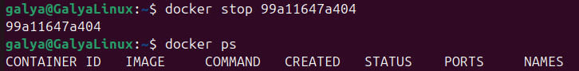

- Запустила докер с портами 80 и 443 в контейнере, замапленными на такие же порты на локальной машине, через команду `run`

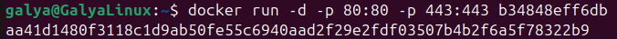

- Проверила, что в браузере по адресу localhost:80 доступна стартовая страница nginx

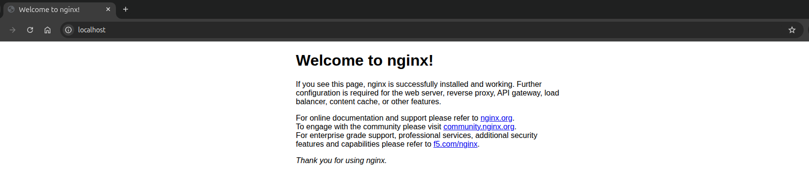

- Перезапустила докер контейнер через `docker restart [container_id]`.

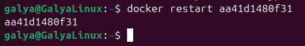

- Проверила, что контейнер перезапустился с помощью `docker ps`

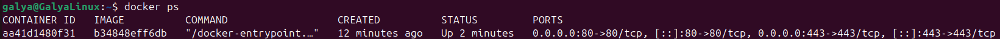

## Part 2. Операции с контейнером

- Прочитала конфигурационный файл nginx.conf внутри докер контейнера через команду `exec`

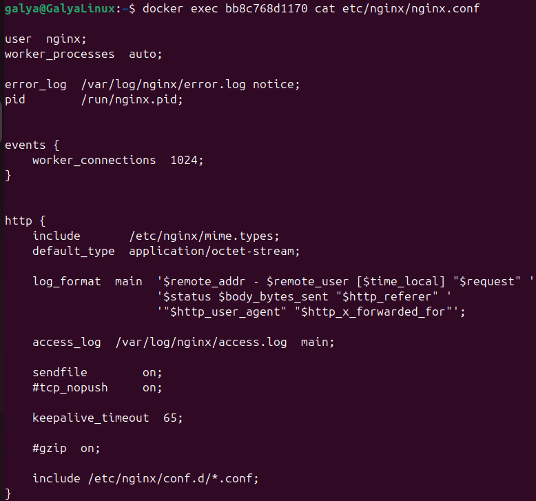

- На локальной машине создала файл nginx.conf

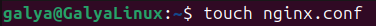

- По пути /status настроила отдачу страницы статуса сервера nginx

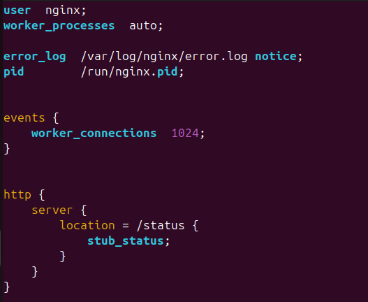

- Скопировала созданный файл nginx.conf внутрь докер-контейнера через `docker cp`

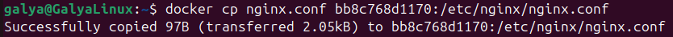

- Перезапуск nginx внутри докер-контейнера через команду `exec`

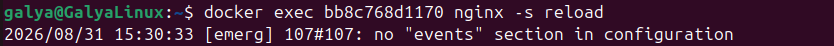

- Проверка отдачи странички со статусом сервера nginx в localhost:80/status

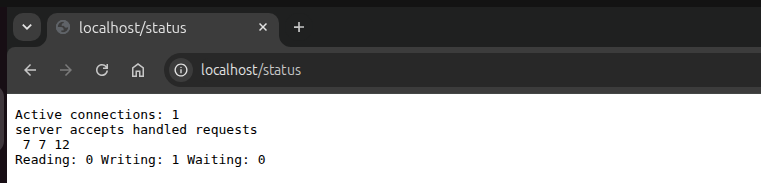

- Экспортировала контейнер в файл container.tar через команду `export`

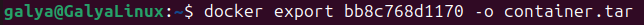

- Остановила контейнер

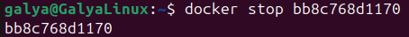

- Попытка удаления образа через docker rmi [image_id] без удадения контейнера

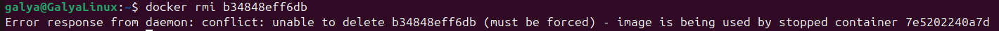

- Принудительное удаление образа

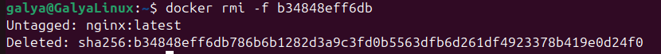

- Удалила остановленный контейнер

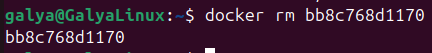

- Создала образ из файла container.tar через команду `import`

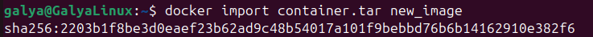

- Создала и запустила контейнер на основе импортированного образа

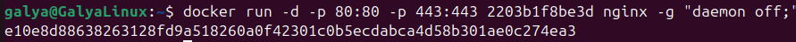

- Проверила, что по адресу localhost:80/status отдается страничка со статусом сервера nginx

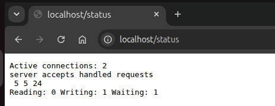
