## Part 1. Настройка gitlab-runner

- Подняла виртуальную машину Ubuntu Server 24.04 LTS.
- Скачала и установила на ВМ gitlab-runner. Проверила версию с помощью команды `gitlab-runner --version`

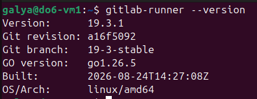

Проверила, что **gitlab-runner** запущен: `sudo systemctl status gitlab-runner`

Зарегистрировала раннера командой: `sudo gitlab-runner register`

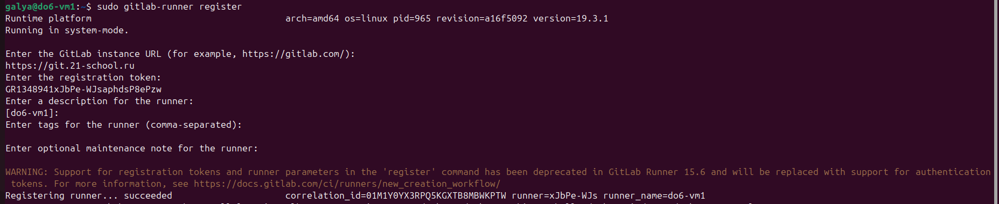

Указала URL и токен со страницы задания на платформе. В качестве executor выбрала shell.

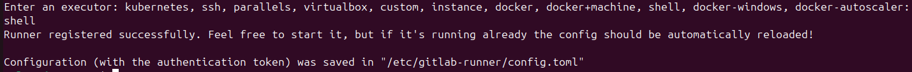

## Part 2. Сборка

- Скопировала приложение из директории code-samples. 
-  В файле .gitlab-ci.yml  добавила этап запуска сборки через мейк файл из папки code-samples.
- Файлы, полученные после сборки (артефакты), сохранила в произвольную директорию со сроком хранения 30 дней.

Итоговый пайплайн для Part 2:

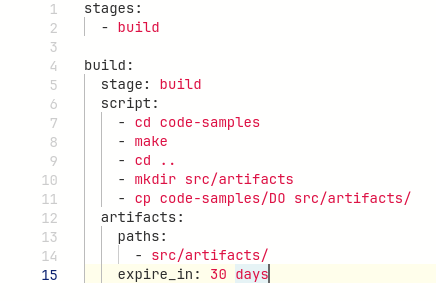

Демонстрация успешной работы: 

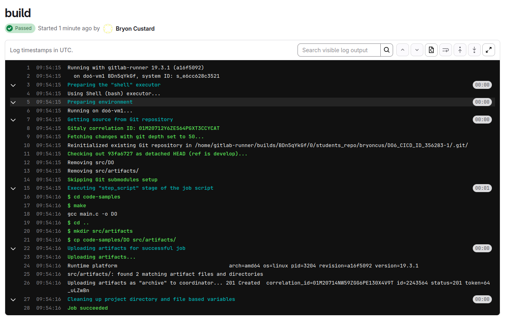

## Part 3 Тест кодстайла

Написала этап для CI, который запускает скрипт кодстайла (clang-format).

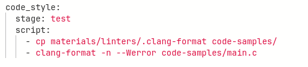

Демонстрация выполнения условия "если кодстайл не прошел, то «зафейли» пайплайн."
Также видно вывод утилиты clang-format.

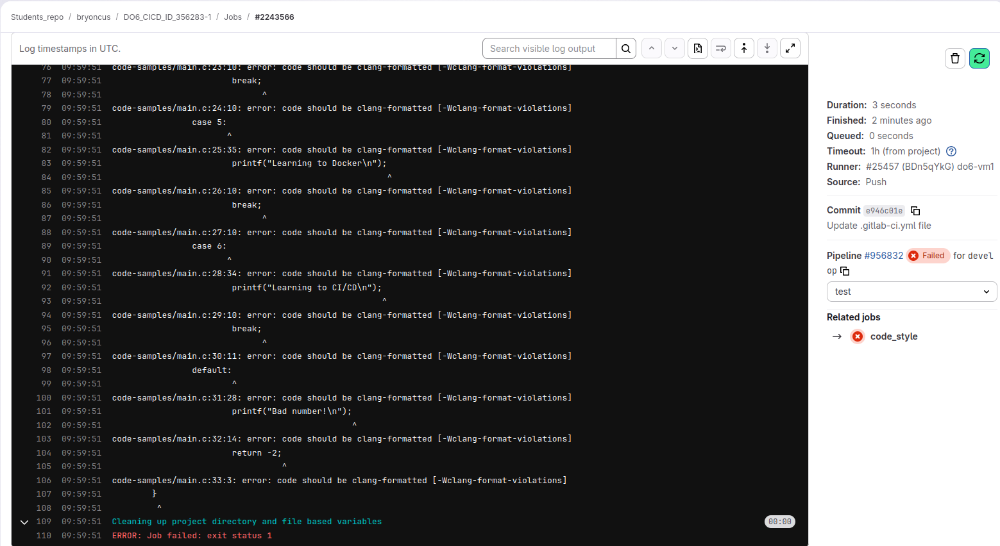

Демонстрация успешного теста:

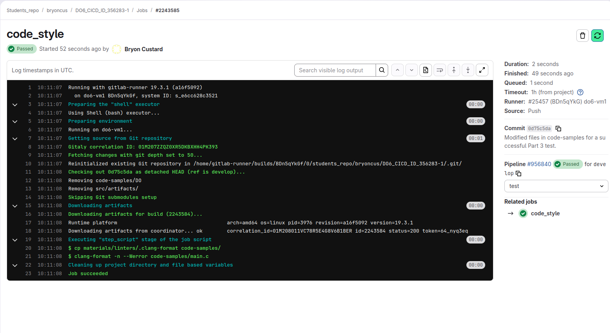

## Part 4 Интеграционные тесты

Написала простой интеграционный тест на bash. Он вызывает собранное приложение для проверки работоспособности на разных случаях.

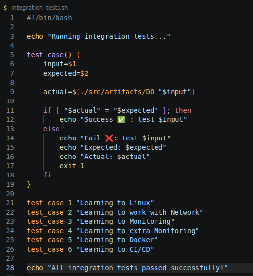

Дополнила пайплайн:

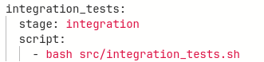

Демонстрация успешного прохождения всех трёх этапов:

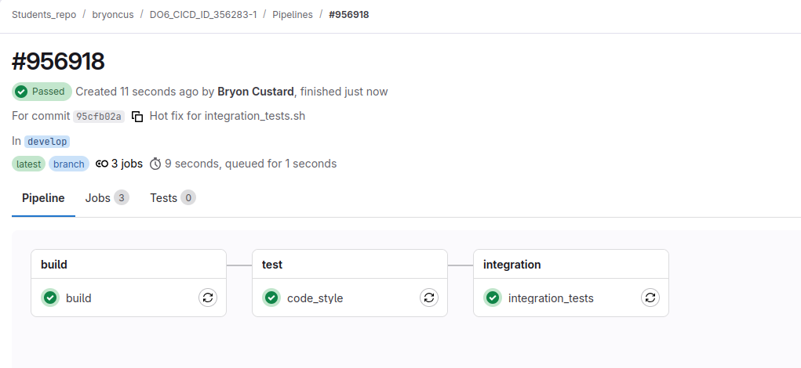

Вывод успеха интеграционного теста:

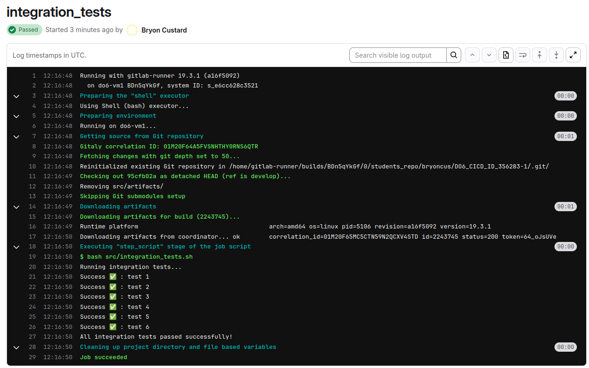

Проверка, что пайплайн не идёт дальше при фейле на одном из этапов.

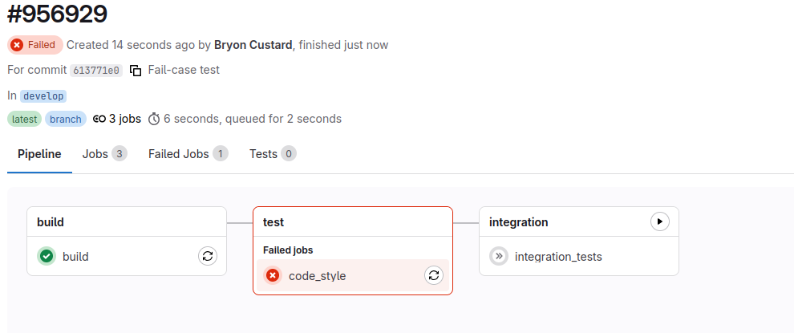

Демонстрация «фейла» пайплайна при провале теста.
Вывод в пайплайне при провале. 

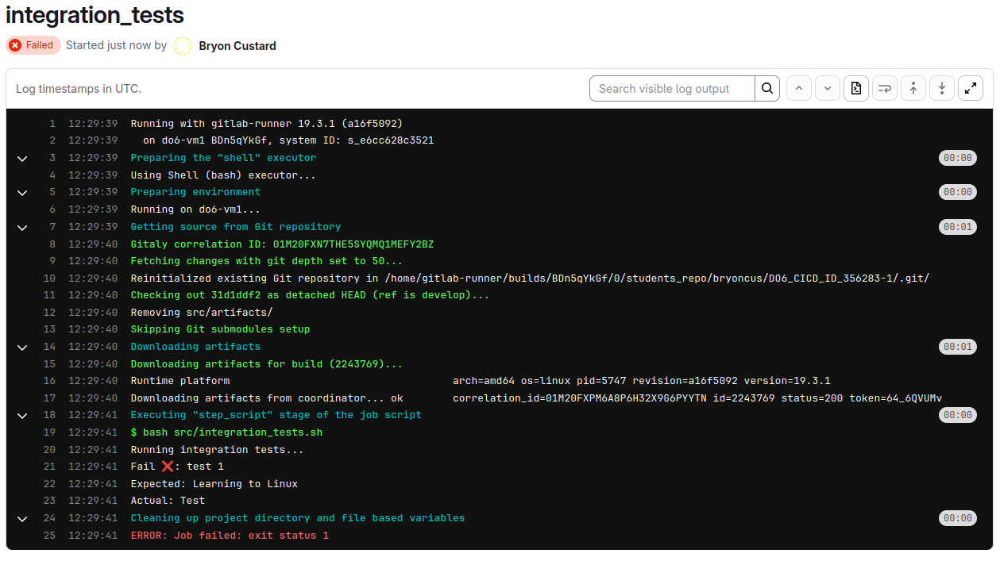

## Part 5. Этап деплоя

- Для пользователя **gitlab-runner** настроила подключение по SSH ко второй машине do6-vm2. 
- С помощью команды `sudo visudo` добавила права на `mv` без ввода пароля: `galya ALL=(ALL) NOPASSWD: /usr/bin/mv`

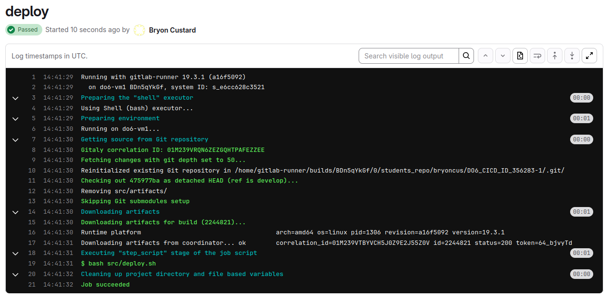

Фейл пайплайна в случае ошибки. 

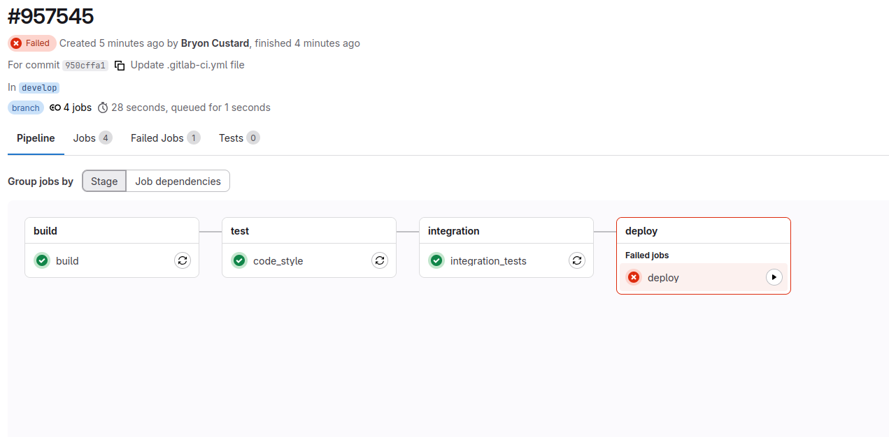

## Part 6 - Дополнительно. Уведомления

Создала тг бота через BotFather. Статусы CI/CD передала боту через скрипт notifications.sh. Уведомление дошло успешно.

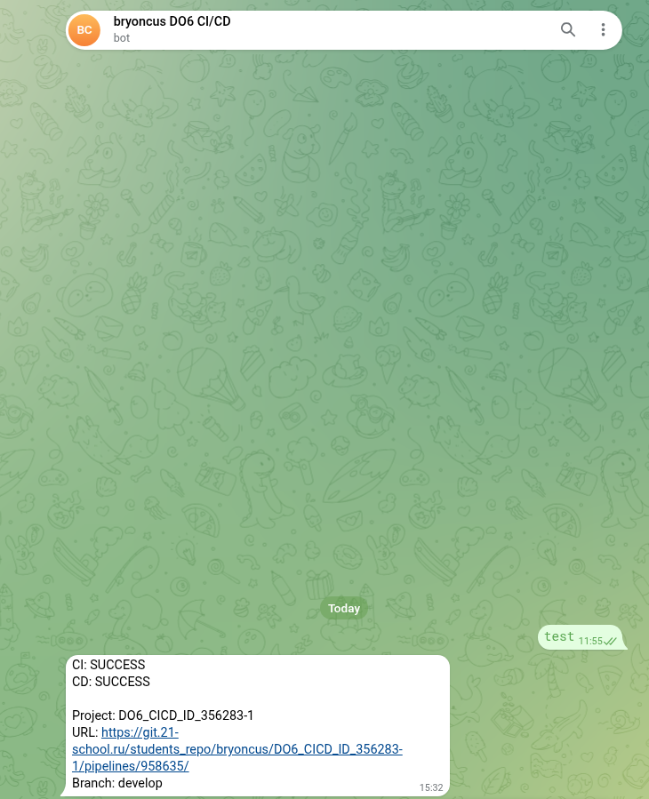

Сохранила дампы виртуальных машин.

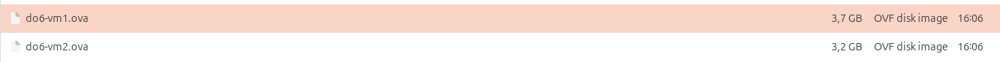

Итоговый пайплайн:

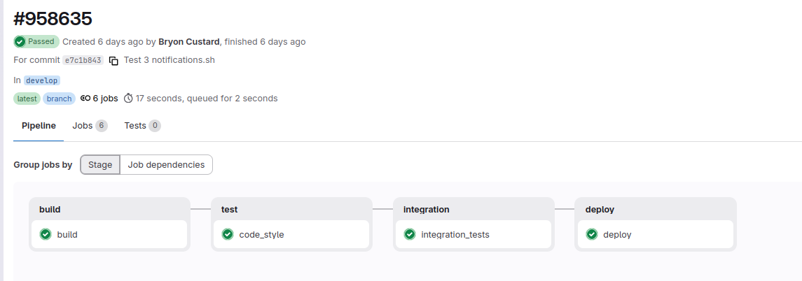

Мой .gitlab-ci.yml:

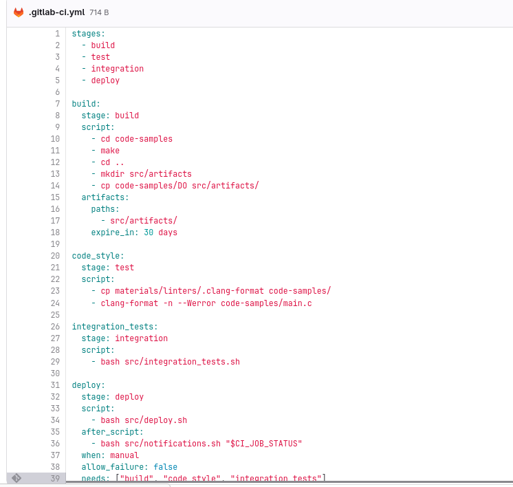